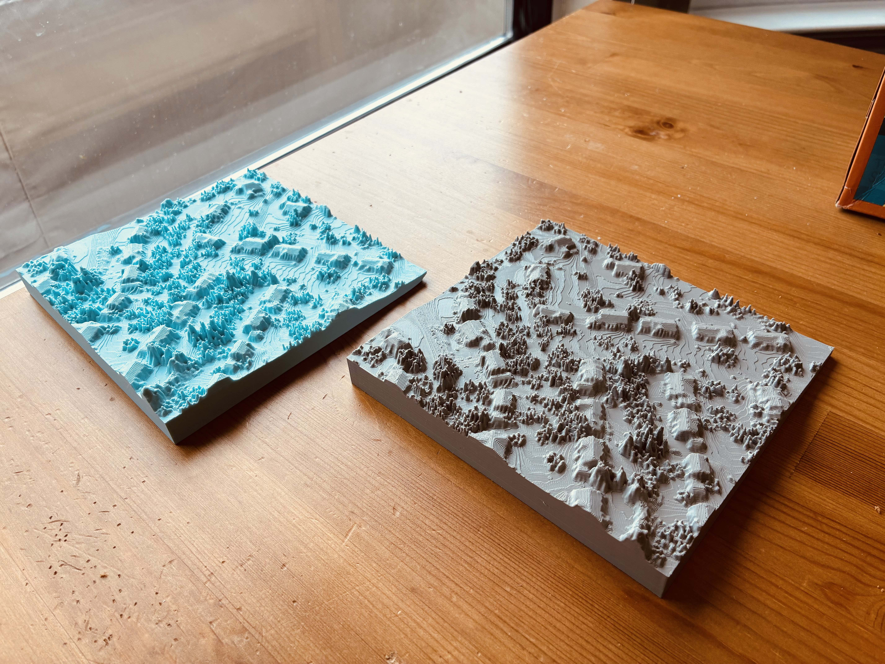
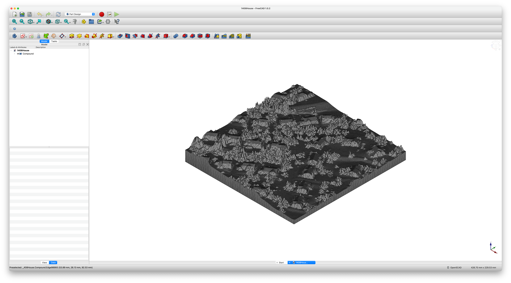
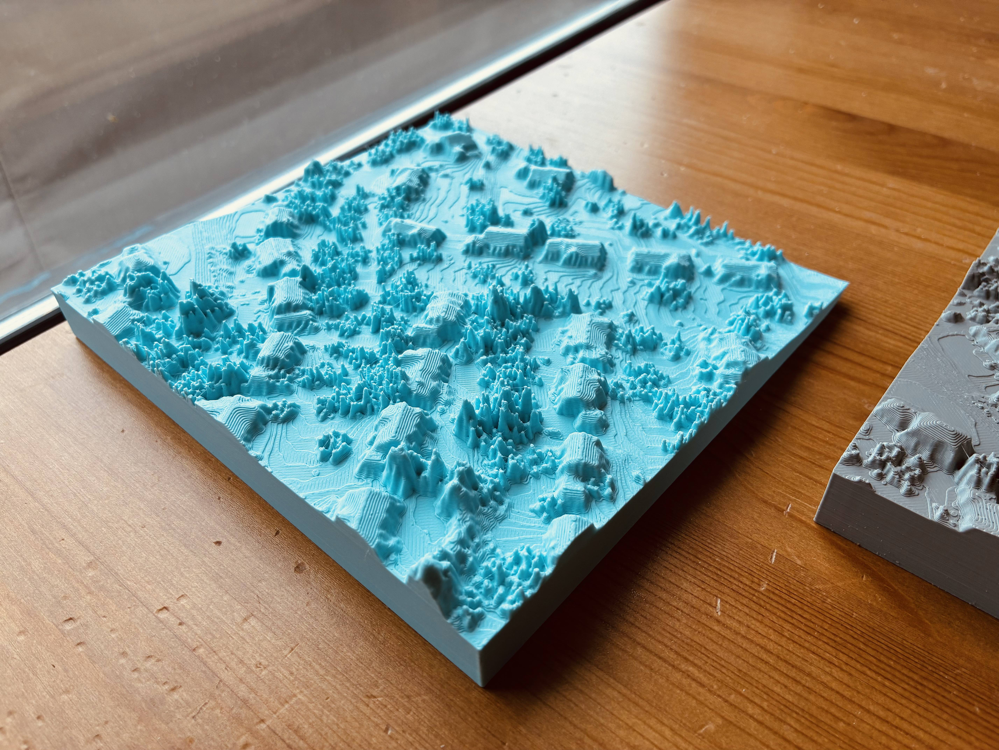
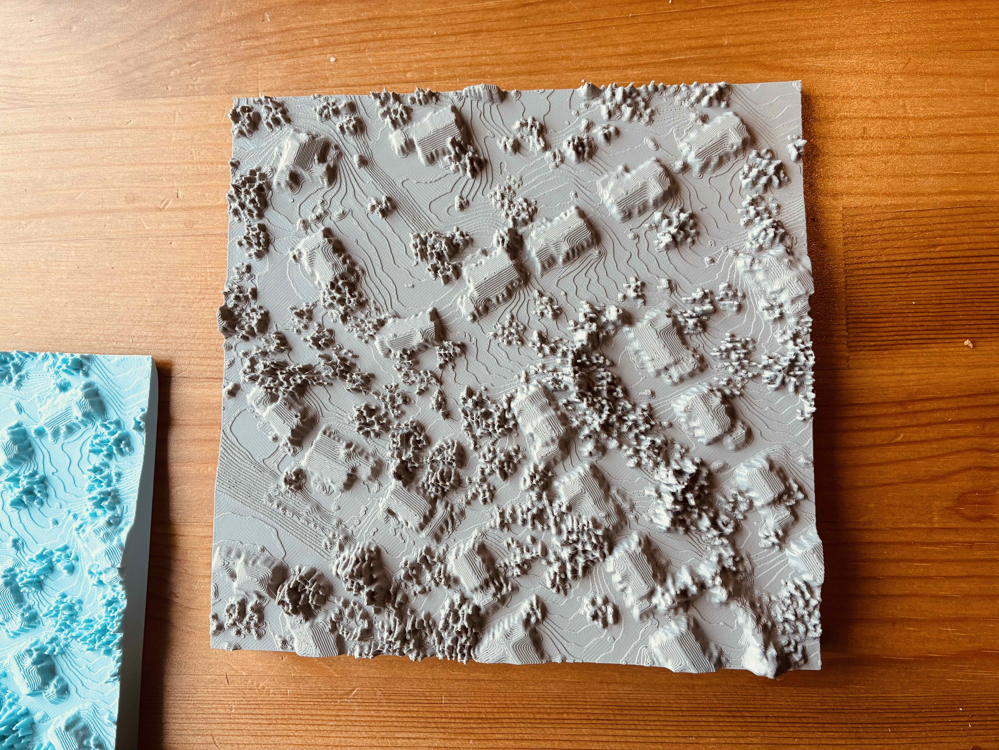
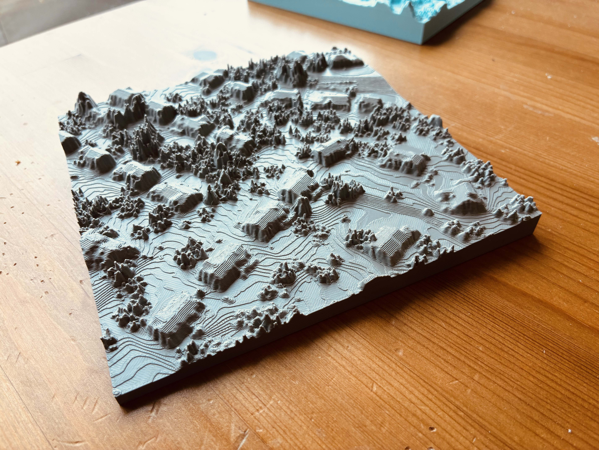

# [](#header-1)How to 3D Print My Neighorhood on Bambu Lab X-1 Carbon



## [](#header-2)Data Preparation
Using [PDAL](https://pdal.org/en/2.9.3/) tool to clip on [USGS 3DEP LiDAR Point Clouds on AWS](https://registry.opendata.aws/usgs-lidar/) dataset and export it `*.las` format.

python example:

```python
import json
import pdal

s3_path='https://s3-us-west-2.amazonaws.com/usgs-lidar-public'
# For project name, you can find it here: https://usgs.entwine.io/
# for same area, it could be covered by multiple lidar projects
project = ''

pl = [dict(type='readers.ept',
           bounds='([{0}, {1}], [{2}, {3}])'.format(minx, maxx, miny, maxy),
           filename='{0}/{1}/ept.json'.format(s3_path, project),
           tag='readdata'),
      dict(type='filters.expression',
           expression='Classification!=7 && Classification!=5 && Classification!=3 && Classification!=4',
           tag='nonoise'),
      dict(type='filters.assign',
           assignment='Classification[:]=0',
           tag='wipeclasses'),
      dict(type='writers.las',
                   filename=os.path.join(os.getcwd(), 'output', fn),
                   compression=True)]
pipeline_input = json.dumps(dict(pipeline=pl))
pipeline = pdal.Pipeline(pipeline_input)
pipeline.execute()
      
```

## [](#header-2)Import the clipped pointcloud to QGIS
Follow this [tutorial](https://www.pointsnorthgis.ca/blog/viewing-point-clouds-qgis/), drag and drop the `*.las` file into `QGIS.app` 

## [](#header-2)Build the TIN (Triangulated Irregular Network)
Follow this [QGIS offical tutorial](https://docs.qgis.org/3.40/en/docs/user_manual/map_views/3d_map_view.html) for build the TIN mesh model and then export the 3D model to `*.obj` file format

## [](#header-2)Convert OBJ file to STL file for 3D print
By using [FreeCAD](https://www.freecad.org/), we can import `*.obj` file and covert it soild and save the model as `STL` format

In the top menu bar: select 'Part ==> Create shape from mesh', and then 'Part ==> convert to solid', don't forget to scale it down, the exported model is in 1:1 scale, scale it down (e.g. 1:10000)



## [](#header-2)Sent the model for 3D Print
The model was printed on a Bambu Lab X-1 Carbon Combo 3D Printer in a Public Library, here is the printing config;

- standard 0.4 nozzle with minimum layer height we can get and 100% infill to print

Here is how it looks! Now you can hang it on the wall as a special decoration in your home!






