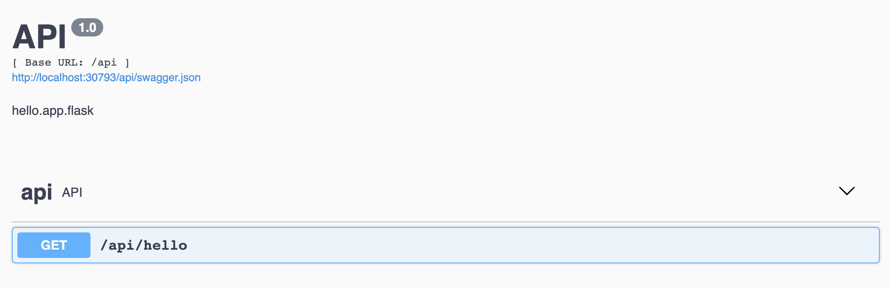

## [](header-2)Use Kubernetes as local development environment on Mac
### [](header-3)Step1 Enable Kubernetes
#### 1.1 Download Docker Desktop for Mac at here: 
https://hub.docker.com/editions/community/docker-ce-desktop-mac/
#### [](header-4)1.2 Install Docker for Mac:
https://docs.docker.com/docker-for-mac/install/

#### [](header-4)1.3 Enable Kubernetes:

*Note: if you already have Kubernetes installed, or your Kubernetes are configured not by Docker, you may need to back up your Kubernetes config file (`~/.kube/config`) before proceed this tutorial. After you walk through this tutorial, you can always merge the content of your backups to the Docker generated Kubernetes config file in a text editor. 

[https://docs.docker.com/docker-for-mac/#preferences](https://docs.docker.com/docker-for-mac/#preferences)  
[https://docs.docker.com/docker-for-mac/#kubernetes](https://docs.docker.com/docker-for-mac/#kubernetes)

### [](header-3)Step2 Kubernetes Dashboard
#### [](header-4)2.1 Deployment
To deploy Dashboard, execute following command:
```bash
kubectl apply -f https://raw.githubusercontent.com/kubernetes/dashboard/v2.0.1/aio/deploy/recommended.yaml
```
*Please check updated Dashboard at here:  https://github.com/kubernetes/dashboard

#### [](header-4)2.2 Create start/stop script
Create and put follow content in `kube-dashboard.sh`.
```bash
#!/bin/bash
USER_KUBE_DASHBOARD=${HOME}/.${USER}-kube-dashboard.pid

function quit() {
    if test -f ${USER_KUBE_DASHBOARD}; then
        kill -9 $(head -n 1 ${USER_KUBE_DASHBOARD})
        rm -f ${USER_KUBE_DASHBOARD}
    fi
}

case "$1" in
    start)
        quit
        kubectl proxy &>/dev/null & echo $! > ${USER_KUBE_DASHBOARD}
        ;;         
    stop)
        quit
        ;;
    restart)
        start
        ;;         
    *)
        echo $"Usage: $0 {start|stop|restart}"
        exit 1
esac
```
Now you can start or stop Dashboard by `./kube-dashboard.sh start`.
```
Usage: ./kube-dashboard.sh {start|stop|restart}
```
Open Dashboard link in a browser.  
http://localhost:8001/api/v1/namespaces/kubernetes-dashboard/services/https:kubernetes-dashboard:/proxy/

#### [](header-4)2.3 Dashboard login
##### [](header-5)2.3.1 Generate token for docker desktop user
Now we need to find token we can use to log in. Execute following command:
```bash
kubectl -n kubernetes-dashboard describe secret $(kubectl -n kubernetes-dashboard get secret | grep docker-desktop | awk '{print $1}')
```
Now copy the token and paste it into `Enter token` field on the login screen.

Click `Sign in` button and that's it. You are now logged in.
##### [](header-5)2.3.2 Use config file to login (Optional)
Copy Kubernetes config file to a place, such as to your Desktop `cp ~/.kube/config ~/Desktop/config`.
Now open `~/Desktop/config` in a text editor and add token to `users`.
```yaml
......
kind: Config
preferences: {}
users:
- name: docker-desktop
  user:
    client-certificate-data: <REDACTED>
    client-key-data: <REDACTED>
    token: <*add your token here*>
```
Then save your config file.
### [](header-3)Step3 Deploy Nginx (Optional, but recommended)
In order to test Kubernetes environment, we'll deploy Nginx, so execute following command:
```bash
kubectl apply -f https://k8s.io/examples/controllers/nginx-deployment.yaml
```
*Please check updated Nginx deployment at here: https://kubernetes.io/docs/concepts/workloads/controllers/deployment/#creating-a-deployment

Check Nginx deployed in pods through command
```bash
kubectl get pods
```
Verfiy Nginx deployment
```bash
kubectl get deployments
kubectl get deployment nginx-deployment
```
Check Nginx service
```bash
kubectl get services
kubectl get service nginx-deployment
```
Check Nginx service details
```bash
kubectl describe service nginx-deployment
```
```text
Name:                     nginx-deployment
Namespace:                default
Labels:                   app=nginx
Annotations:              <none>
Selector:                 app=nginx
Type:                     NodePort
IP:                       10.105.242.222
LoadBalancer Ingress:     localhost
Port:                     <unset>  80/TCP
TargetPort:               80/TCP
NodePort:                 <unset>  31597/TCP
Endpoints:                10.1.0.27:80
Session Affinity:         None
External Traffic Policy:  Cluster
Events:                   <none>
```
*Since our service type is `NodePort`, you can reach Nginx from a link like `http://localhost:<NodePort>`. For example: `http://localhost:31597`

*For understanding more details of service type, please read through this article:
https://www.bmc.com/blogs/kubernetes-services/
### [](header-3)Step4 Deploy a Flask API
In this example, we'll deploy a Flask API (Nginx + uwsgi + Flask) to Kubernetes
#### [](header-4)4.1 Download API source code
```bash
git clone https://github.com/yanfuzhou/a-flask-app.git
```
Run from local
```bash
pip install -r requirements.txt
./uwsgi.sh
```
Then navigate to http://localhost:4000/api in your web browser


#### [](header-4)4.2 Deploy to Kubernetes
To deploy to Docker Kubernetes, execute following command:
```bash
./docker_deploy.sh -i a-flask-app -c app.conf
```
Check `docker_deploy.sh` usage.
```bash
Usage: docker_deploy.sh [-h] [-i DOCKER_IMAGE] [-c ENVIRONMENT_VARIABLE_BASH_FILE]
optional arguments:
  -h, --help            show this help message and exit
  -i DOCKER_IMAGE, --repository_tag DOCKER_IMAGE
                          Docker image name - [REPOSITORY:TAG]
  -c ENVIRONMENT_VARIABLE_BASH_FILE, --flask_app_conf ENVIRONMENT_VARIABLE_BASH_FILE
                          Flask app environemt variable bash file, such as 'export API_NAME=hello.app.flask'
```
#### [](header-4)4.3 Kubernetes JSON template
The Kubernetes deployment template files are located in `deployments/template` folder
```bash
ls -l deployments/template 
-rw-r--r--  1 uid  gid  1263 Jun  7 20:04 deployments.json
-rw-r--r--  1 uid  gid   399 Jun  7 20:04 env.json
-rw-r--r--  1 uid  gid   230 Jun  7 20:04 kustomization.json
-rw-r--r--  1 uid  gid  1170 Jun  7 20:04 nginx-config.json
-rw-r--r--  1 uid  gid  1002 Jun  7 16:47 nginx.conf
-rw-r--r--  1 uid  gid   254 Jun  7 20:04 service.json
```
*In some cases, you may want to generate `*.yaml` file in `deployments` folder seperately, then you could run `generate_kustomization.py` inside `deployments` folder.
```bash
-rw-r--r--  1 uid  gid   861 Jun  7 22:05 deployments.yaml
-rw-r--r--  1 uid  gid   241 Jun  7 22:05 env.yaml
-rwxr-xr-x@ 1 uid  gid  5272 Jun  7 20:32 generate_kustomization.py
-rwxr-xr-x@ 1 uid  gid   510 Jun  6 14:25 kube-dashboard.sh
-rw-r--r--  1 uid  gid   182 Jun  7 22:05 kustomization.yaml
-rw-r--r--  1 uid  gid  1221 Jun  7 22:05 nginx-config.yaml
-rw-r--r--  1 uid  gid   152 Jun  7 22:05 service.yaml
drwxr-xr-x  8 uid  gid   256 Jun  7 20:31 template
```
Check `generate_kustomization.py` usage.
```bash
./generate_kustomization.py -h
usage: generate_kustomization.py [-h] -i IMG_NAME [-c FILE]

optional arguments:
  -h, --help            show this help message and exit
  -i IMG_NAME, --repository_tag IMG_NAME
                        Docker image name - [REPOSITORY:TAG] (default: None)
  -c FILE, --flask_app_conf FILE
                        Path of Flask app environmental variable file
                        (default: None)
```
##### [](header-5)4.3.1 Take a quick glance at the `deployments/template` folder

The service type and service ports are defined in `service.json` file and Nginx configurations are specified in `nginx-config.json` and mapped to the Nginx configuration folder through [ConfigMap](https://kubernetes.io/docs/concepts/configuration/configmap/) at the runtime. The `deployments.json` is just like a [docker compose file](https://docs.docker.com/compose/compose-file/#volumes), it's a definition of infrastructure. It defines docker images that will be used in this deployment and also defines whether they have shared volumes or port between containers. The `env.json` file defines required environmental variables for running the Flask API. 

*Note: we are not defining Kubernetes [Horizontal Pod Autoscaler](https://kubernetes.io/docs/tasks/run-application/horizontal-pod-autoscale/#how-does-the-horizontal-pod-autoscaler-work) and [Ingress](https://kubernetes.io/docs/concepts/services-networking/ingress/#what-is-ingress) in this example, because we're just using Kubernetes as a local development environment for testing docker build and API networks POC design.

##### [](header-5)4.3.2 Check Flask API service

```bash
kubectl get service a-flask-app
```
```text
NAME          TYPE       CLUSTER-IP      EXTERNAL-IP   PORT(S)        AGE
a-flask-app   NodePort   10.110.187.97   <none>        80:30793/TCP   12h
```
Open `http://localhost:30793/api` in a web browser and you'll see its swagger doc, and **all done!**

