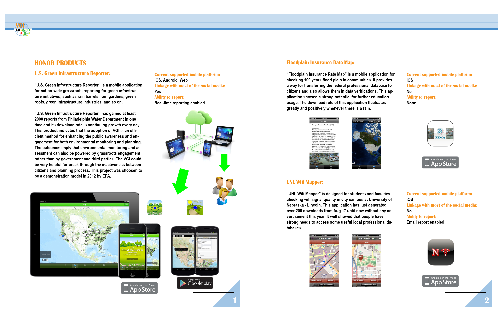
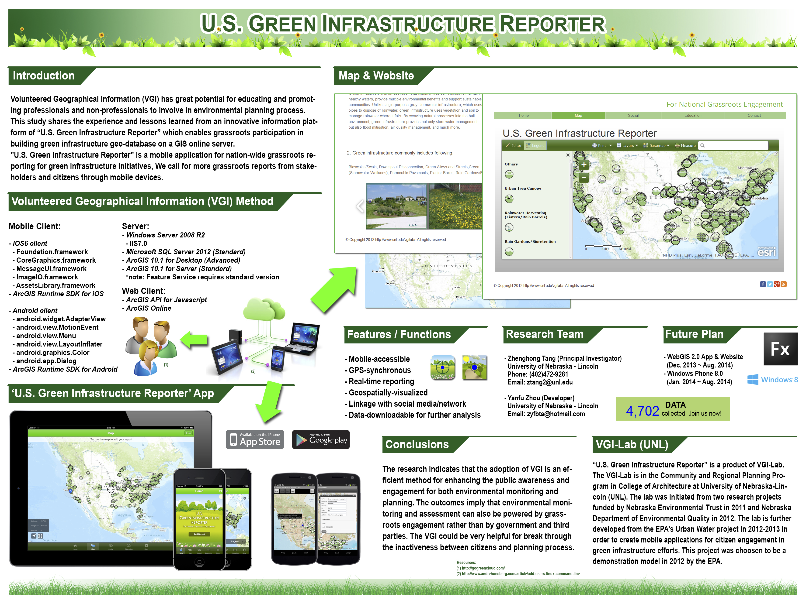
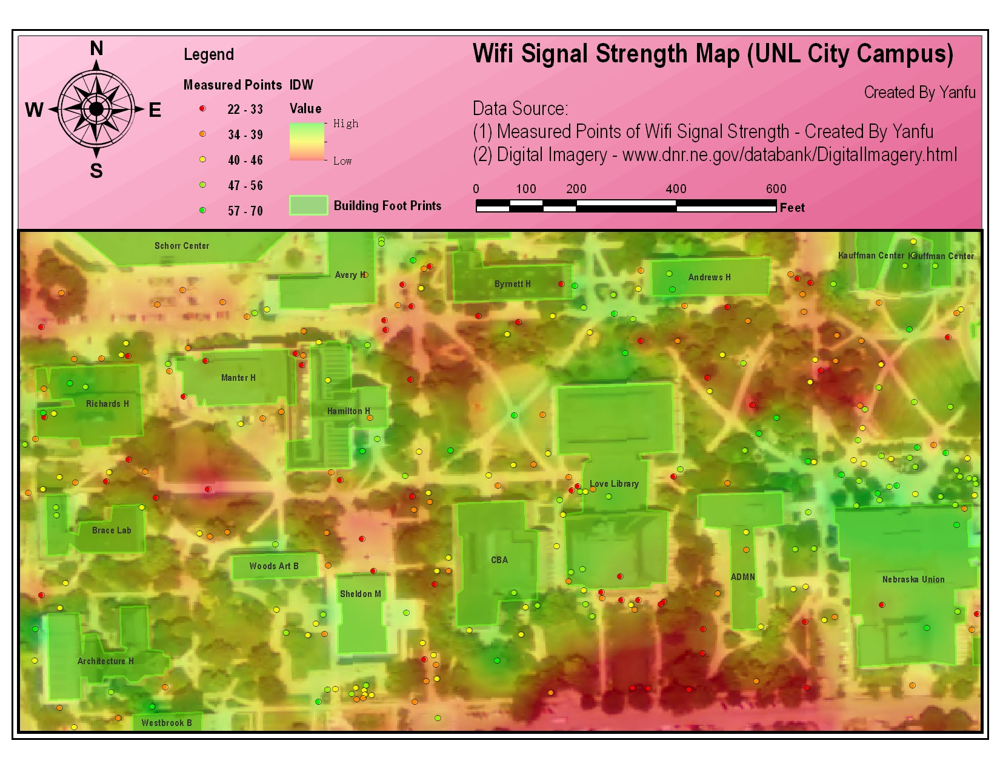
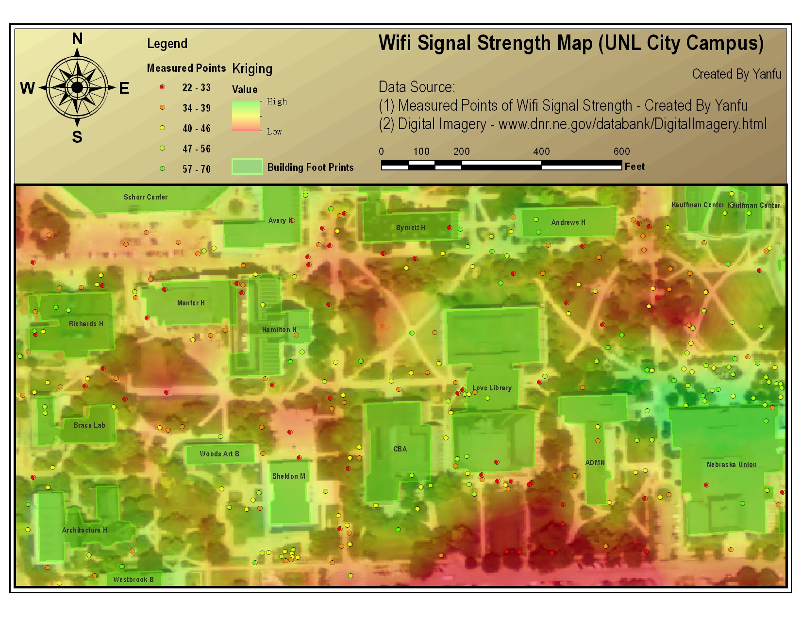

###  Mobile GIS App list

All apps were developed during the Steve Jobs Era

Tech stack: ArcGIS Server, ArcGIS Online, ArcGIS SDK for iOS/Android, SQL Server

- U.S. Green Infrastructure Reporter (iOS, Android, Web)
- Floodplain Insurance Rate Map (iOS)
- UNL Wifi Mapper (iOS)

[Enlarge the list](../images/mobileGIS01.jpg)

###  Poster of the U.S. Green Infrastructure Reporter

[Enlarge the poster](../images/mobileGISPoster02.png)

###  UNL Wifi Mapper App data, which was published on ArcGIS Online

[Enlarge the IDW result](../images/wifi-idw.jpg)

[Enlarge the Kriging result](../images/wifi-kriging.jpg)