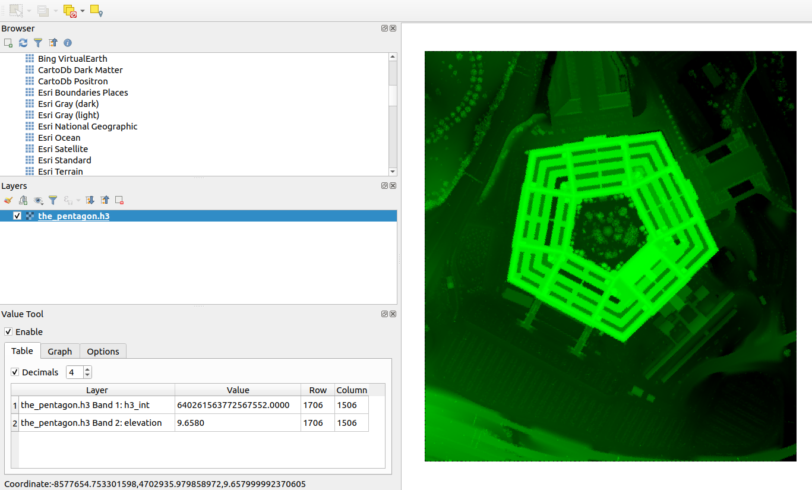

# [](#header-1)Walk through the AWS LIDAR H3

The AWS LIDAR H3 is a tool for producing hexagonal DEM from [USGS 3DEP LiDAR Point Clouds (Open Data on AWS)](https://registry.opendata.aws/usgs-lidar/). The USGS 3DEP LiDAR Point Clouds are indexed as [entwine point tile (EPT)](https://entwine.io/entwine-point-tile.html). It  is a simple and flexible octree-based storage format for point cloud data. The AWS LIDAR H3 is built on top of three key libraries. They are [PDAL](https://pdal.io/), [GDAL](https://gdal.org/) and [H3](https://h3geo.org/), etc. Other libraries are [numpy](https://numpy.org/), [pandas](https://pandas.pydata.org/), [shapely](https://shapely.readthedocs.io/en/stable/manual.html) and [scipy](https://scipy.org/), etc.

## [](#header-2)Download
Please install [Docker](https://www.docker.com/) before proceed, this is the prerequisite.  

For avoiding the headache of creating an essential complex development environment for locally run, the AWS LIDAR H3 tool is built into a docker image, and it was published in docker hub: [https://hub.docker.com/r/yzhou16/aws-lidar-h3](https://hub.docker.com/r/yzhou16/aws-lidar-h3)

Once you've installed docker locally, you can download the AWS LIDAR H3 tool as follow:

```bash
$ docker pull yzhou16/aws-lidar-h3
```

Then you can check its command options like below:

```bash
$ docker run --rm yzhou16/aws-lidar-h3 /aws-lidar-h3/aws-lidar-h3.py -h
usage: aws-lidar-h3.py [-h] -b BOUNDS [BOUNDS ...]
                       [-usgs USGS_ENTWINE_BOUNDARIES_URL] [-s3 LIDAR_S3]
                       [-n19] [-r H3_RES] [-be] [-s] [-c] [-i]
                       [-n NUM_HEX_SPLIT_TO_PIXELS]
                       [-bs IMAGE_BLOCK_SIZE [IMAGE_BLOCK_SIZE ...]]
                       [-nd NO_DATA] [-p OUTPUT_PATH] -f OUTPUT_FILE_NAME
```

and here are the explainations for each option:

```text
-h, --help            show this help message and exit
-b BOUNDS [BOUNDS ...], --bounds BOUNDS [BOUNDS ...]
                    minx, miny, maxx, maxy - for example: -180.0 -90.0
                    180.0 90.0
-usgs USGS_ENTWINE_BOUNDARIES_URL, --usgs_entwine_boundaries_url USGS_ENTWINE_BOUNDARIES_URL
                    USGS 3DEP LIDAR coverage boundaries
-s3 LIDAR_S3, --lidar_s3 LIDAR_S3
                    USGS 3DEP LiDAR dataset s3 path, such as
                    https://s3-us-west-2.amazonaws.com/usgs-lidar-public
-n19, --ned19         also export ned19 dem
-r H3_RES, --h3_res H3_RES
                    h3 index resolution, default is 14, see details at:
                    https://h3geo.org/docs/core-library/restable
-be, --bare_earth     only use bare earth classification to build elevation
-s, --smooth_z        use smoothed elevation in calculations
-c, --export_header   export csv header
-i, --export_image    export hexagons as an image
-n NUM_HEX_SPLIT_TO_PIXELS, --num_hex_split_to_pixels NUM_HEX_SPLIT_TO_PIXELS
                    applied only if only export_image is true, could also
                    be split into 5 pixels along a hexagon diameter,
                    default is 3
-bs IMAGE_BLOCK_SIZE [IMAGE_BLOCK_SIZE ...], --image_block_size IMAGE_BLOCK_SIZE [IMAGE_BLOCK_SIZE ...]
                    applied only if only export_image is true, exported
                    image block size, could also be 256 256, default is
                    512 512
-nd NO_DATA, --no_data NO_DATA
                    pixels no data value, default is -9999
-p OUTPUT_PATH, --output_path OUTPUT_PATH
                    output file path
-f OUTPUT_FILE_NAME, --output_file_name OUTPUT_FILE_NAME
                    output file name
```

## [](#header-2)A tutorial
Let's take the Pentagon as our example.

The Pentagon is located in this bounding box area (the yellow retangular area on the google map):


```text
# minimum longitude, minimum latitude, maximum longitude, maximum latitude
-77.060466, 38.866578, -77.051325, 38.874446
```

For getting the bounding box parameters, you can use [bboxfinder](http://bboxfinder.com/#0.000000,0.000000,0.000000,0.000000) to draw the bounding box and then get its parameters on the bottom left of the map


After you get the bounding box parameters, now we can use the AWS LIDAR H3 tool to produce a hexagonal DEM inside that bounding box area. Beware that your bounding box area must be less than 2km<sup>2</sup>. This is because hexagonal interpolation is an expensive computation, it may consume a lot cpu and memory resources, and this is why I limited the size of data input. 

By default, the AWS LIDAR H3 can produce a hexagonal DEM at resolution 14, and each hexagon at resolution 14 has an area of approximately ~6.3m<sup>2</sup>. For a pixel grid whose area is 6.3m<sup>2</sup>, its edge length is ~2.509m (round off to integer is 3m). It's fortunate that the [1/9th Arc-second DEM](https://data.usgs.gov/datacatalog/data/USGS:40e52270-5c4b-497d-987f-827e374becff) is approximately 3m resolution. So we can compare our hexagonal DEM at resolution 14 with the 1/9th Arc-second DEM.

reference: [https://h3geo.org/docs/core-library/restable](https://h3geo.org/docs/core-library/restable)

### [](#header-3)Data Structure

The AWS LIDAR H3 can produce a hexagonal DEM tiff image, which is a 64bit 2 bands raster file. You can use the [Value Tool Plugin](https://plugins.qgis.org/plugins/valuetool/) in [QGIS](https://qgis.org/en/site/) to check each pixel values in those 2 bands. 1) Band 1 is `h3_int`, which is the integer representation of the h3 index; 2) Band 2 is the elevation and its unit is meters.



For extracting the elevation band and put it into a single tiff image, you need to use GDAL command to reach this:

```bash
$ gdal_translate -b 2 input.tif output.tif
```
reference: [https://gdal.org/programs/gdal_translate.html](https://gdal.org/programs/gdal_translate.html)

### [](#header-3)Command Examples

For producing a hexagonal DEM at resolution 14 for the Pentagon bounding box area:

```bash
$ docker run --rm \
	-v ~/Desktop/output:/aws-lidar-h3/output yzhou16/aws-lidar-h3 /aws-lidar-h3/aws-lidar-h3.py \
	-b -77.060466 38.866578 -77.051325 38.874446 \
	-i -f the_pentagon
```

Then extract the elevation band to a single image
```bash
$ gdal_translate -b 2 the_pentagon.h3.tif the_pentagon.h3.elevation.tif
```
This is the hexagonal DEM rendering. 3D rendering is generated by [Qgis2threejs](https://plugins.qgis.org/plugins/Qgis2threejs/):


---
For producing a hexagonal DEM at resolution 14 and a 1/9th Arc-second DEM for the Pentagon bounding box area:

```bash
$ docker run --rm \
	-v ~/Desktop/output:/aws-lidar-h3/output yzhou16/aws-lidar-h3 /aws-lidar-h3/aws-lidar-h3.py \
	-b -77.060466 38.866578 -77.051325 38.874446 \
	-n19 -i -f the_pentagon
```
This is the 1/9th Arc-second DEM rendering. 3D rendering is generated by [Qgis2threejs](https://plugins.qgis.org/plugins/Qgis2threejs/):


---
Sometimes for hydrology analysis, we prefer to use bare earth DEM with elevation get smoothed:

```bash
$ docker run --rm \
	-v ~/Desktop/output:/aws-lidar-h3/output yzhou16/aws-lidar-h3 /aws-lidar-h3/aws-lidar-h3.py \
	-b -77.060466 38.866578 -77.051325 38.874446 \
	-be -n19 -s -i -f the_pentagon
```

Then extract the elevation band to a single image
```bash
$ gdal_translate -b 2 the_pentagon.bare_earth.h3.tif the_pentagon.bare_earth.h3.elevation.tif
```

On the left is the  hexagonal DEM, and on the right is the 1/9th Arc-second DEM, both of them are bare earth DEM:


---
The AWS LIDAR H3 can also export the hexagonal DEM to a csv file. Either with a csv header or without a csv header

- export to csv with header

```bash
$ docker run --rm \
	-v ~/Desktop/output:/aws-lidar-h3/output yzhou16/aws-lidar-h3 /aws-lidar-h3/aws-lidar-h3.py \
	-b -77.060466 38.866578 -77.051325 38.874446 \
	-c -f the_pentagon
```
- export to csv without header (for BigQuery ingestion)

```bash
$ docker run --rm \
	-v ~/Desktop/output:/aws-lidar-h3/output yzhou16/aws-lidar-h3 /aws-lidar-h3/aws-lidar-h3.py \
	-b -77.060466 38.866578 -77.051325 38.874446 \
	-f the_pentagon
```


