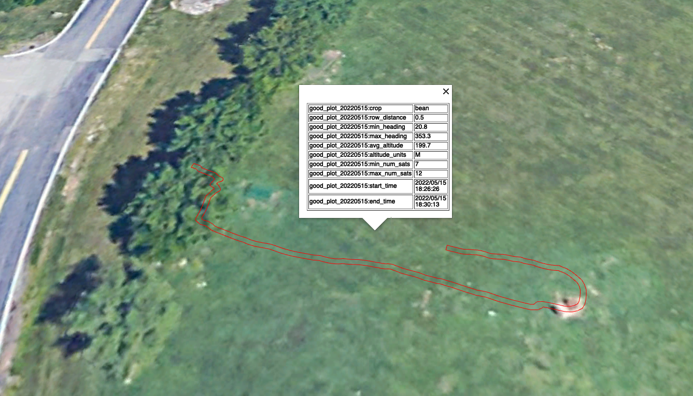

# World's 1st RC Cassette Planter

In precisioning farming, the automated planting system offers a completely new approach to research plot planting. No more coin packets and no more headaches! All plot preparation is done prior to going to the field and one tractor driver can plant thousands plots while stopping only 1 or 2 times to reload the cartridge dispenser.

After I've done with studies of the [QMC5883L magnet compass](./PyQMC5883L.md) and the [DIYMall DY-880TTL GPS](./DY880TTL.md). It's time to put them on a 1/10th scale RC crawler now! (my final goal is to build a autopilot RC cassette planter).

The planter is built from a popular seeder listed on Amazon: [item link](https://www.amazon.com/Bio-Green-BG-SS-Super-Seeder/dp/B001B8Y0H4). I modified it by adding a self-made aluminum towing arm, which can be hooked up to my RC crawler rear bumper.

To demostrate how the planter works in the field, I've also made an animation

As I mentioned in my previous tutorial for studying the [DIYMall DY-880TTL GPS](../docs/DY880TTL.md), the gps, compass and motor are sharing one RC battery.

I first tested my planter on a carpet and planted some soybean, and here is the running video:

<iframe
    width="660"
    height="375"
    src="https://www.youtube.com/embed/HVKiWM-V8hY"
    frameborder="0"
    allow="accelerometer; autoplay; encrypted-media; gyroscope; picture-in-picture"
    allowfullscreen>
</iframe>

Then I did a testing run in a socker field, the gps and compass are working as expected, and here are some details

I loaded the GPS csv file in google earth to check the result that I got

Then I use python to build the plot boundary by using those GPS points

Here is another rendering result in QGIS

