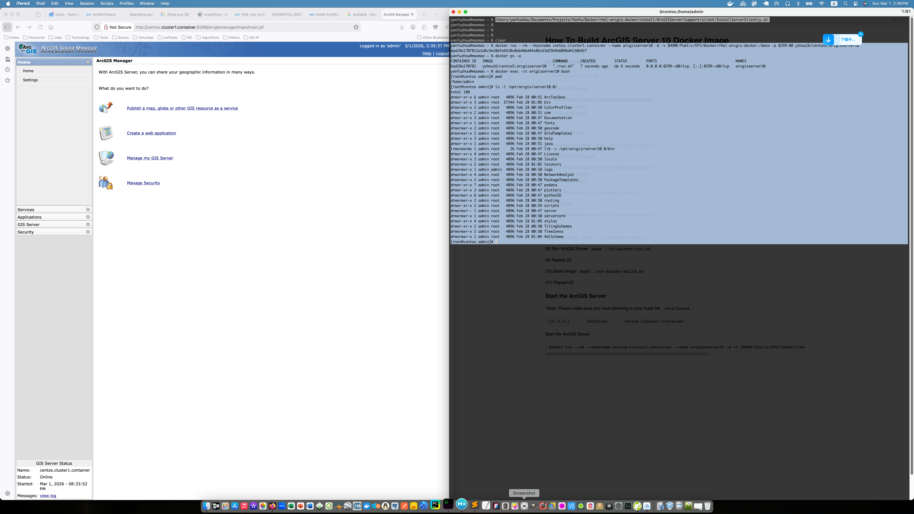

# [](#header-1)Dockerizing ArcGIS Enterprise Server 10.0 SP5 For Linux



## [](#header-2)Why dockerizing the ArcGIS Enterprise Server?
Why? because someone has asked me for another question:

Can ArcGIS Enterprise on Kubernetes be licensed using an existing ArcGIS Enterprise on Windows/Linux license?

Many users have existing ArcGIS Enterprise on Windows/Linux licenses and would like to install ArcGIS Enterprise on Kubernetes using the same license.

An Esri software license is required to access and use ArcGIS Enterprise on Kubernetes. With ArcGIS Enterprise on Windows/Linux, Portal and ArcGIS Server are licensed separately. With ArcGIS Enterprise on Kubernetes, there aren't separate portal and server components. Additionally, ArcGIS Server has a core-based licensing model while the number of cores utilized by ArcGIS Enterprise on Kubernetes can change significantly.

The license required for ArcGIS Enterprise on Kubernetes is on a subscription basis, which is separate from any licenses for ArcGIS Enterprise on Windows and Linux. Unlike Windows and Linux deployments, ArcGIS Enterprise on Kubernetes does not require separate licenses for Portal for ArcGIS and ArcGIS Server. 


## [](#header-2)Benefits for having a dockerized ArcGIS Enterprise Server

(1) You can use an existing ArcGIS Enterprise on Windows/Linux license on Kubernetes without purchase a separate license required for ArcGIS Enterprise on Kubernetes

(2) Assist in the modernization work, if you've installed the ArcGIS Enterprise Server on a bare metal machine, having a dockerized ArcGIS Enterprise Server can help you move to the cloud such as AWS or Google cloud

(3) If I want stick with an old ArcGIS Enterprise Server version (for example, if I want to stick with ArcGIS Enterprise Server 10.0 SP5) and move the service to somewhere else, you don't need to re-do the installation work on the old discontuinued OS. Finding their supported packages are usually hard and time consuming because their update mirrors are already closed

## [](#header-2)An example of dockerizing the ArcGIS Enterprise Server 10.0 SP5

### Key ideas:

We can leveraging [Install ArcGIS Server silently](https://enterprise.arcgis.com/en/server/11.4/install/linux/silently-install-arcgis-server.htm) for doing this.

In the legacy `ArcGIS_ServerEnterprise10_for_RedHatLinuxExterprise_and_SUSELinuxEnterprise.rar` package, we can find a script in this path:

`ArcGIS_ServerEnterprise10_for_RedHatLinuxExterprise_and_SUSELinuxEnterprise/ArcGISServer/ArcGISServer/support/silent/InstallServerSilently.sh` 

The script is using the `SampleSilentServer.properties` file (available in the same path) for install the server, then update the property file to use the existing ArcGIS Enterprise on Windows/Linux license (*.ecp), then we can start the installation process inside the docker container.

While until now a day, all the ArcGIS Enterprise Server for Linux are still using X Window System. If you want to install the server using a GUI wizard (Just like the installation wizard on MS Windows), you need to consider setup a X11 server for doing that.

The interesting thing I found that ESRI didn't mention on their website, for ArcGIS Enterprise Server 10.0 SP5, because that X Window System, it doesn't work with the method of building the container image using a dockerfile, and even if we're going to install silently inside the container, the X Window System packages (xorg-x11-* packages) required by the installation wizard is still needed on the server OS. I've double checked this with their official documentation and this is not listed there. While I am not sure about other ArcGIS Enterprise Server versions like 10.5, 10.8, etc. However this is still missing from their [archived documentation page](https://desktop.arcgis.com/en/system-requirements/latest/os-limits-linux.htm)

Here is the content of the property file I've used:

```bash
USER_INSTALL_DIR=/opt/arcgis
FEATURE_LIST=SOM, SOC, PythonSrvr, SrvJADF, DevDoc
Z_FQDN_USER=centos.cluster1.container
SOM_MACHINE=centos.cluster1.container
SRV_USER=admin
Z_AUTH_FILE=/mnt/cdrom/license.ecp
```

I also updated the `CD_ROOT` variable in `InstallServerSilently.sh` for making sure it finds the correct path of the binary installation file

```bash
CD_ROOT=/mnt/cdrom
```

Here is the shell script for how to build the container automatically

```bash
#!/bin/bash

docker pull centos:5.11 && docker run --rm --hostname centos.cluster1.container --name arcgisserver10 -d -v $HOME/Documents/Projects/Yanfu/Docker/rhel-arcgis-docker/install/packages:/tmp/packages -v $HOME/Documents/Projects/Yanfu/Docker/rhel-arcgis-docker/install/apache:/tmp/apache -v $HOME/Documents/Projects/Yanfu/Docker/rhel-arcgis-docker/install/scripts:/tmp/scripts -v $HOME/Documents/Projects/Yanfu/Docker/rhel-arcgis-docker/install/ArcGISServer:/mnt/cdrom -p 8299:80 centos:5.11 sh -c 'chmod +x /tmp/scripts/setup-all.sh && /tmp/scripts/setup-all.sh && tail -f /dev/null'
current_string=""
stop_string="Starting Xvfb on port 600"
while true; do
    log_string="$(docker logs --tail 1 arcgisserver10)"
    if [[ "$current_string" != "$log_string" ]]; then
        echo "$log_string"
        current_string="$log_string"
    fi
    if echo "$log_string" | grep -q "$stop_string"; then
        sleep 30
    	break
    fi
done
docker commit arcgisserver10 yzhou16/centos5:arcgisserver10 && docker stop arcgisserver10
docker build -t yzhou16/centos5:arcgisserver10 .
docker image prune -f
```

It calls the `setup-all.sh` shell scripts inside the container, here is how it look like:

```bash
#!/bin/bash
if [ ! -f '/etc/mtab' ]; then cat /proc/mounts > /etc/mtab; fi
if [ -f '/etc/pki/tls/certs/ca-bundle.crt' ]; then rm -f /etc/pki/tls/certs/ca-bundle.crt; fi
chmod +x /mnt/cdrom/support/silent/InstallServerSilently.sh
chmod +x /mnt/cdrom/gis10-sp5-server-linux/applypatch
rpm -ivh --nosignature --force /tmp/packages/*.rpm
rpm -e openssl-0.9.8e-27.el5_10.4 openldap-2.3.43-28.el5_10
rpm -ivh --nosignature --force /tmp/apache/*.rpm
if [ -f '/etc/init.d/httpd' ]; then echo -e '<VirtualHost *:80>\n\tProxyRequests Off\n\tProxyPreserveHost On\n\tProxyPass /arcgismanager http://localhost:8099/arcgismanager\n\tProxyPassReverse /arcgismanager http://localhost:8099/arcgismanager\n\tProxyPass / http://localhost:8399/\n\tProxyPassReverse / http://localhost:8399/\n</VirtualHost>' >> /etc/httpd/conf/httpd.conf; fi
if [ -f '/etc/init.d/httpd' ]; then /etc/init.d/httpd start; fi
useradd -m -s /bin/bash admin
su - root -c '/mnt/cdrom/support/silent/InstallServerSilently.sh /mnt/cdrom/support/silent/SampleSilentServer.properties' && cat /tmp/ArcGISServerSilent.log
su - admin -c 'cd /mnt/cdrom/gis10-sp5-server-linux && printf "\n\n\n\n" | ./applypatch'
usermod -g root admin
mkdir -p /data
chown -R admin:root /data
chmod 770 /data
chmod +x /tmp/scripts/run.sh
yes | cp /tmp/scripts/run.sh /home/admin/run.sh
```

## [](#header-2)Launch the ArcGIS Enterprise Server 10.0 SP5 For Linux into a container

*Note: Please make sure you have following in your hosts file `/etc/hosts`:

```bash
127.0.0.1       localhost       centos.cluster1.container
```

After we built the image, we can simply launch  the ArcGIS Enterprise Server 10.0 SP5 For Linux into a docker container:

```bash
docker run --rm --hostname centos.cluster1.container --name arcgisserver10 -d -v $HOME/Public/EFS/Docker/rhel-arcgis-docker:/data -p 8299:80 yzhou16/centos5:arcgisserver10
```

- `$HOME/Public/EFS/Docker/rhel-arcgis-docker` this is the path where you can place the `*.mxd` ArcMap file
- `/data` this is the internal path inside container where you can find your `*.mxd` ArcMap file
- The arcgis manager can be accessed at `http://<server>:8299/arcgismanager/`
- The published restful service endpoint is at `http://<server>/arcgis/rest/services`

*Note, we run an apache server inside the container to hide the 8399 port for the arcgis server restful endpoint, without hide the port, the link looks like this `http://<server>:8399/arcgis/rest/services`

After we launch the image into a docker container, we can see following via `docker ps -a` command

```bash
docker ps -a
CONTAINER ID   IMAGE                            COMMAND      CREATED         STATUS         PORTS                                     NAMES
6ad28a170781   yzhou16/centos5:arcgisserver10   "./run.sh"   7 seconds ago   Up 6 seconds   0.0.0.0:8299->80/tcp, [::]:8299->80/tcp   arcgisserver10
```

Result in web browser and arcgis server installation path inside the container is showing in above


