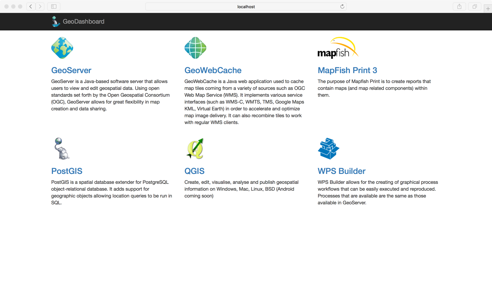

# [](header-1)Dockerized GeoServer with GDAL plugin

Dockerfile for [GeoServer](https://geoserver.org/) with [GDAL](https://gdal.org/) and other extensions, based on [CentOS7](https://www.centos.org/)

## [](header-2)Requirements

Docker needs to be installed on your machine. So download docker from here:  

[https://www.docker.com/community-edition](https://www.docker.com/community-edition) 

and here is its documentation:  

[https://docs.docker.com/learn/](https://docs.docker.com/learn/)

## [](header-2)Pull image

```bash
docker pull yzhou16/gdal-geoserver:latest
```

## [](header-2)Usage

To run (if port 6080 is available and open on your host):

```bash
$ docker run -d --name gdal-geoserver -p 6080:8080 yzhou16/gdal-geoserver
```
or (if you want to connect to other host and have a shared folder between docker and your host)

```
$ docker run --name gdal-geoserver -d -p 6080:8080 -v <source path>:/opt/data_dir yzhou16/gdal-geoserver
```

or to assign a random port that maps to port 8080 on the container:

```
# docker run -d --name gdal-geoserver -P yzhou16/gdal-geoserver
```

To the port that the container is listening on:

```bash
$ docker ps -a
```

## [](header-2)Authentication

* Username: `admin`
* Password: `geoserver`
* Master's password: `geoserver`

*Note: you should change the password after first login.

## [](header-2)Testing
open `http://localhost:6080/dashboard` in your web browser  


