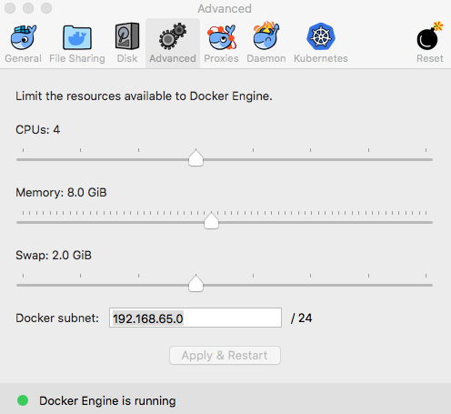
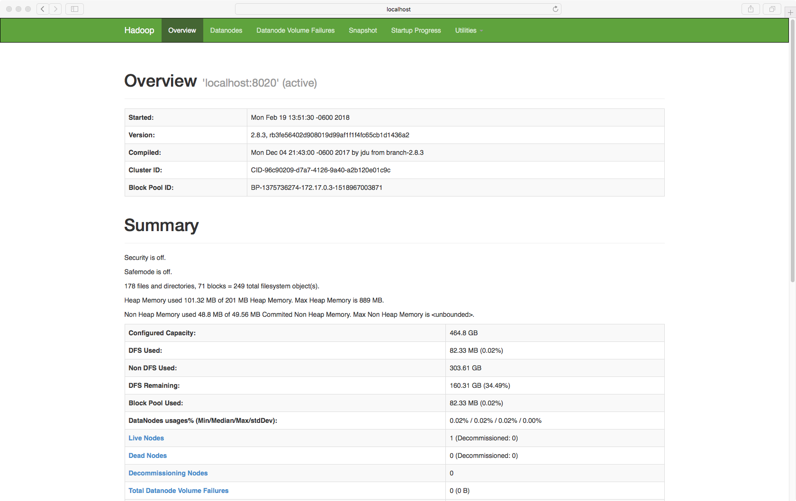
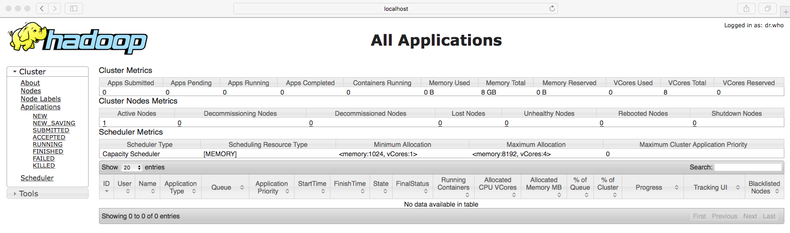
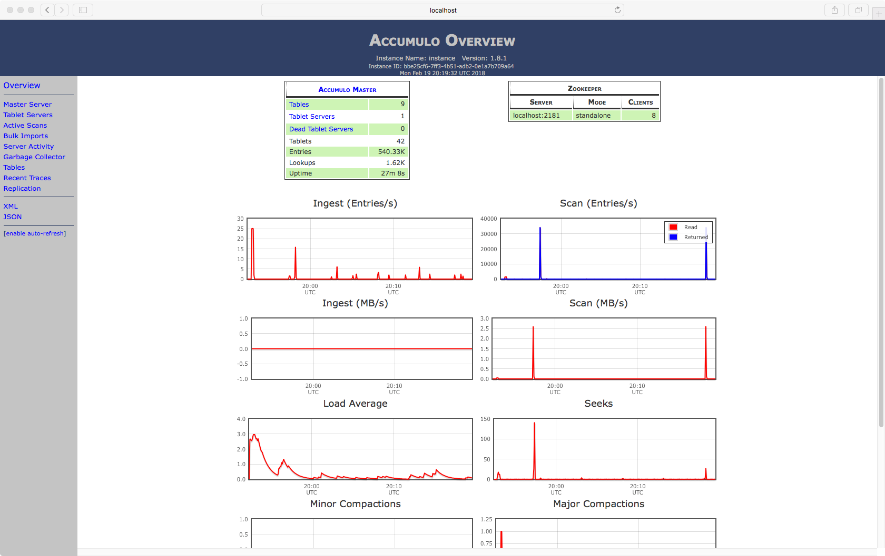
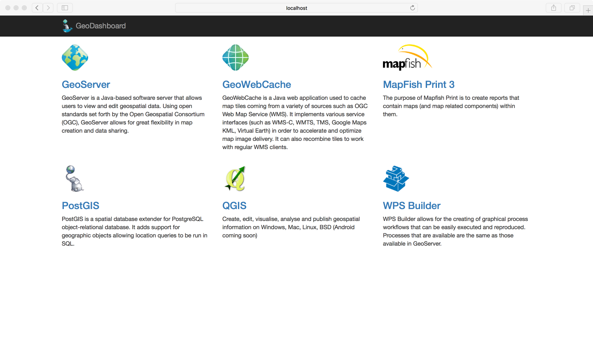
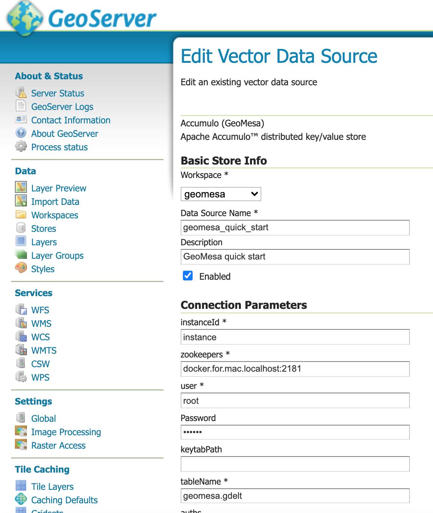
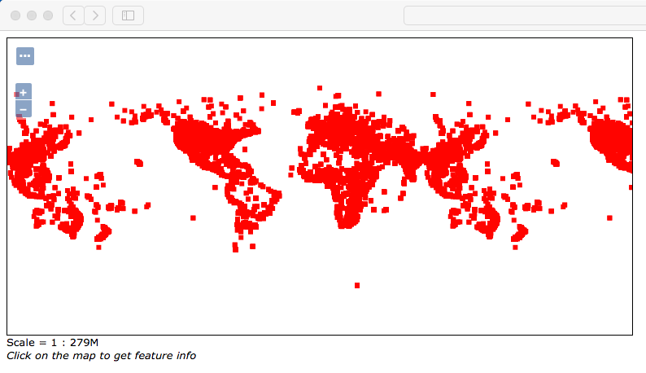

# [](#header-1)Dockerized GeoServer with GDAL plugin and Geomesa datastore

Dockerfile of GeoServer with GDAL and other extensions + GeoMesa Accumulo full backend in a single container

---

## [](#header-2)Dependencies

[PostgresSQL 9.6](https://www.postgresql.org/), [Hadoop 2.8.4](https://hadoop.apache.org/), [Accumulo 1.9.2](https://accumulo.apache.org/), [GeoMesa 1.3.5](https://www.geomesa.org/), [GDAL 2.2.4](https://gdal.org/), [Tomcat 8.5.38](https://tomcat.apache.org/) and [GeoServer 2.11.3](https://geoserver.org/)

## [](#header-2)Requirements

*Note: before you start, please make sure you have `16GB` memory and set your Docker preferences like below:

 

Docker needs to be installed on your machine. So download docker from here:  

https://www.docker.com/community-edition  

and here is its documentation:  

https://docs.docker.com/learn/

## [](#header-2)Pull image

```bash
$ docker pull yzhou16/geomesa-gdal-geoserver:latest
```
---

## [](#header-2)Usage

*Note: do not use `localhost` as for `--hostname`, otherwise Accumulo won't connect remotely!

To run it with a console interaction (if port `50070, 50075, 8042, 8088, 2181, 9995, 9997, 42424, 6080` is available and opening on your host):

```bash
$ docker run --hostname centos.cluster0.container --name geomesa-gdal-geoserver -it -p 50070:50070 -p 50075:50075 -p 8042:8042 -p 8088:8088 -p 2181:2181 -p 9995:9995 -p 9997:9997 -p 42424:42424 -p 6080:8080 yfzhou/geomesa-gdal-geoserver bash
$ /opt/run.sh
```

*Note: use above command to do 1st time run, don't forget to do  

```bash
$ docker cp geomesa-gdal-geoserver:/hdfs ${HOME}/Public/EFS/Docker/geomesa-gdal-geoserver
$ docker cp geomesa-gdal-geoserver:/zookeeper ${HOME}/Public/EFS/Docker/geomesa-gdal-geoserver
$ docker cp geomesa-gdal-geoserver:/opt/data_dir ${HOME}/Public/EFS/Docker/geomesa-gdal-geoserver
```

Then do not commit back to the image, just exit the container, or if you want to connect to other host and have shared folders between docker and your host

```bash
$ docker run --hostname centos.cluster0.container --name geomesa-gdal-geoserver -it -p 50070:50070 -p 50075:50075 -p 8042:8042 -p 8088:8088 -p 2181:2181 -p 9995:9995 -p 9997:9997 -p 42424:42424 -p 6080:8080 -v <geoserver shared folder path>:/opt/data_dir -v <hadoop shared folder path>:/hdfs -v <zookeeper shared folder path>:/zookeeper yfzhou/geomesa-gdal-geoserver bash
$ /opt/run.sh
```

or to assign random ports that maps to all the exposed ports on the container:

```bash
$ docker run --hostname centos.cluster0.container --name geomesa-gdal-geoserver -it -p 50070 -p 50075 -p 8042 -p 8088 -p 2181 -p 9995 -p 9997:9997 -p 42424 -p 6080:8080 yfzhou/geomesa-gdal-geoserver bash
$ /opt/run.sh
```

*Note: the `wps builder` requires a fixed `GeoServer` port at `6080`, other ports could be random.

or to RUN it without a console interaction

```bash
$ docker run --hostname centos.cluster0.container --name geomesa-gdal-geoserver -d -p 50070:50070 -p 50075:50075 -p 8042:8042 -p 8088:8088 -p 2181:2181 -p 9995:9995 -p 9997:9997 -p 42424:42424 -p 6080:8080 -v <geoserver shared folder path>:/opt/data_dir -v <hadoop shared folder path>:/hdfs -v <zookeeper shared folder path>:/zookeeper yfzhou/geomesa-gdal-geoserver
```

To check the port that the container is listening on:

```bash
$ docker ps -a
```

## [](#header-2)Authentication

* Username: `admin`
* Password: `geoserver`
* Master's password: `geoserver`

*Note: you should change the password after first login.

## [](#header-2)Test
Hadoop Master: [http://localhost:50070](http://localhost:50070)  
  
Hadoop Cluster: [http://localhost:8088](http://localhost:8088)  
  
Accumulo: [http://localhost:9995](http://localhost:9995)  
  
GeoServer: [http://localhost:6080/dashboard](http://localhost:6080/dashboard)  
  

### [](#header-3)Publish a geomesa layer
Publish the layer, create a workspace named as `geomesa`.  
Data Source Name: `geomesa_quick_start`   
Description: `GeoMesa quick start`  
instanceId: `instance`  
zookeepers: `docker.for.mac.localhost:2181`  
user: `root`  
Password: `secret`  
tableName: `geomesa.gdelt`

 