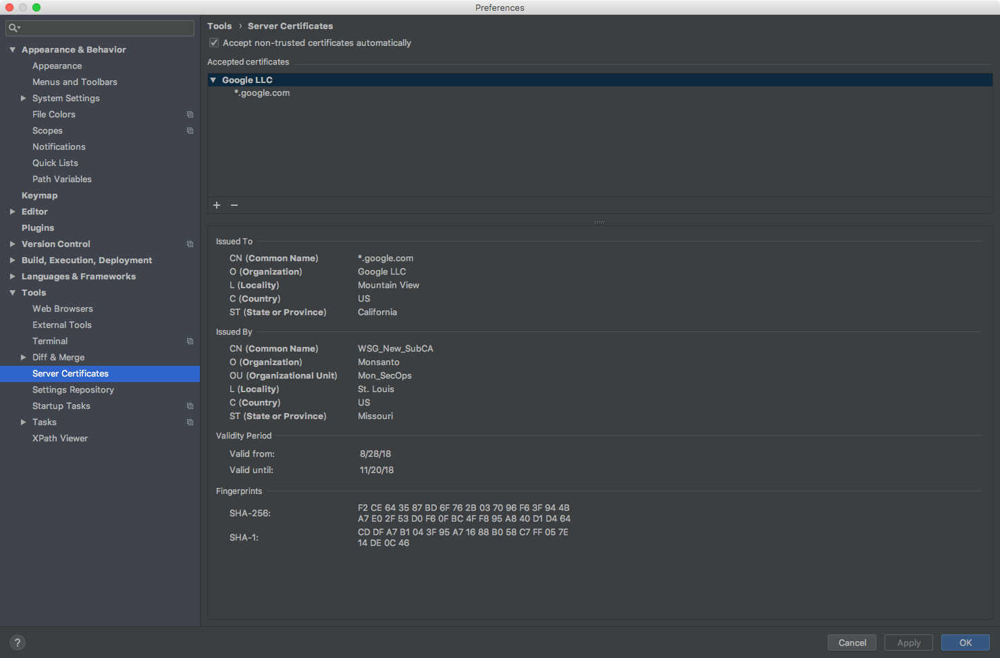
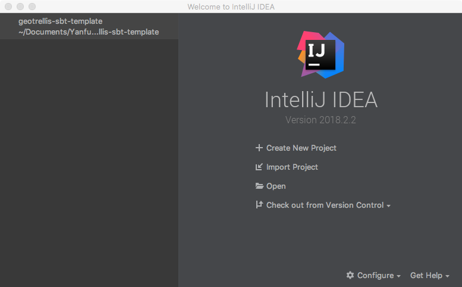
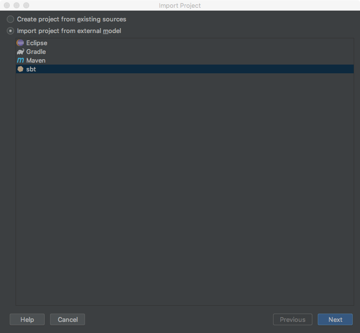
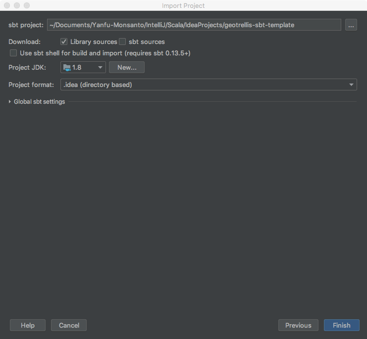
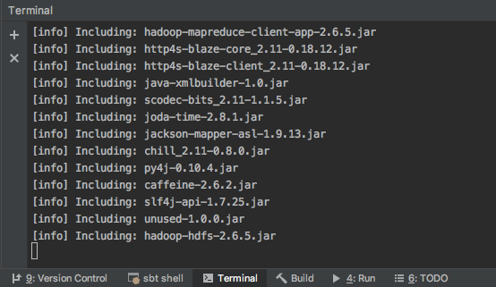
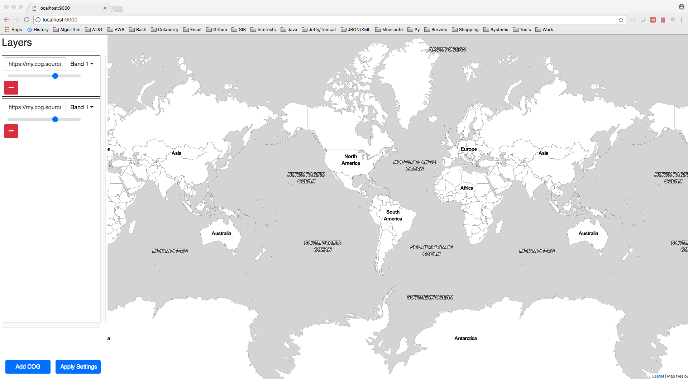
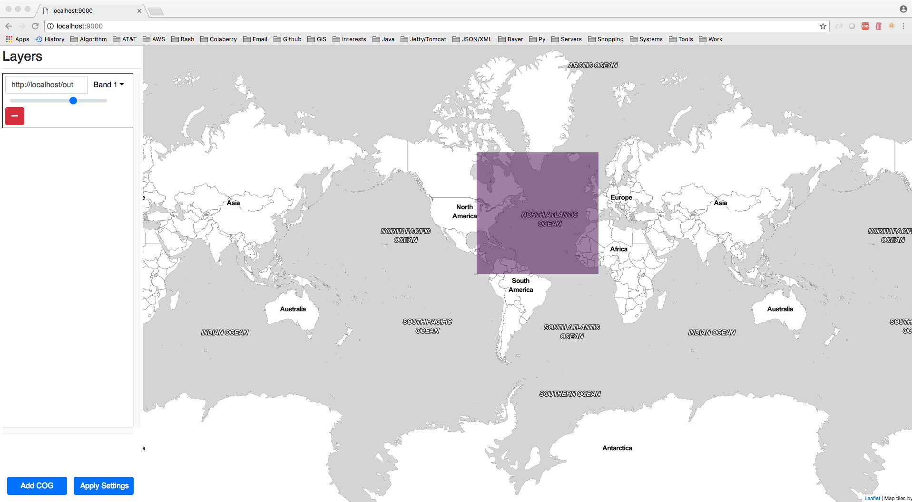
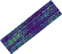
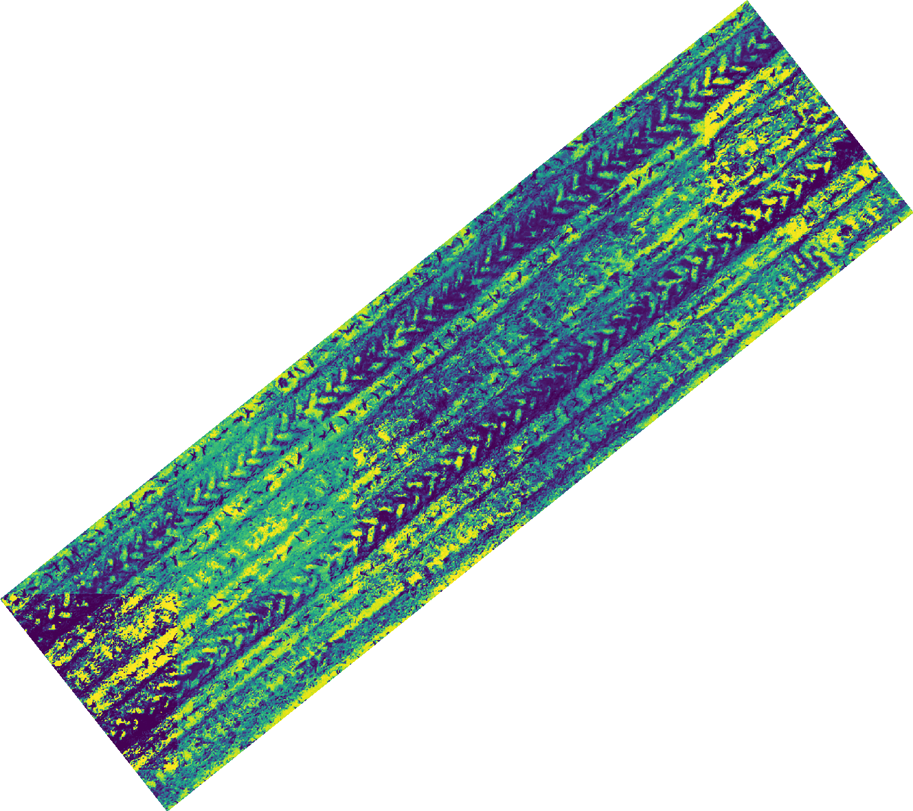

# [](header-1)Accessing GeoTrellis image server and dynamic tile stitching

A python client for [GeoTrellis](https://geotrellis.io/) TMS service

---
## [](header-2)For setup development environment
### [](header-3)Requirements

#### [](header-4)Install `Java 8` from Oracle
[Download Java 8 @here](http://www.oracle.com/technetwork/java/javase/downloads/index.html)

After installation, in the terminal, check your Java version

```
> javac -version
javac 1.8.0_162
```
Version must be `1.8+`

#### [](header-4)Install `Apache Spark 2` from [Homebrew](https://brew.sh/)

After installation, make sure to put following lines in your `~/.bashrc` file,  

```
## Apache Spark
export SPARK_HOME="/usr/local/Cellar/apache-spark/2.3.0/libexec"
export SPARK_CONF_DIR="${HOME}/Applications/spark/config"
PATH="${SPARK_HOME}/bin:${SPARK_HOME}/sbin:${PATH}"
```

and then do `source ~/.bashrc`

Then in the terminal, check your spark version

```
> which spark-submit
/usr/local/bin/spark-submit

> spark-submit --version
Welcome to
      ____              __
     / __/__  ___ _____/ /__
    _\ \/ _ \/ _ `/ __/  '_/
   /___/ .__/\_,_/_/ /_/\_\   version 2.3.0
      /_/

Using Scala version 2.11.8, Java HotSpot(TM) 64-Bit Server VM, 1.8.0_162
Branch master
Compiled by user sameera on 2018-02-22T19:24:29Z
Revision a0d7949896e70f427e7f3942ff340c9484ff0aab
Url git@github.com:sameeragarwal/spark.git
Type --help for more information.
```

### [](header-3)Setting up IDE for development

#### [](header-4)Download and install `IntelliJ IDEA` from `JET BRAINS`

[Download IntelliJ IDEA @here](https://www.jetbrains.com/idea/download/#section=mac)

<span style="color:red;">**_* And please make sure in your `IntelliJ IDEA`, go to `Preferences` --> `Tools` --> `Server Certificates` and check the box `Accept non-trusted certificates automatically`, otherwise you may fail to import the project later._**</span>



#### [](header-4)Download `GeoTrellis Project Template`

```
> git clone https://github.com/geotrellis/geotrellis-sbt-template.git
```

After this, start your `IntelliJ IDEA`, and select `Import Project`, then in the `Import Project` window, select `SBT` and then click `Next`, and then clicl `Finish`.





*To add more GeoTreillis Modules as dependencies in your project, please [look@here](https://docs.geotrellis.io/en/latest/tutorials/setup.html#a-la-carte-geotrellis-modules)

### [](header-3)Building a Geotrellis Overlay Server

```
> git clone https://github.com/geotrellis/geotrellis-server.git
```

Import and open `geotrellis-server` project into `IntelliJ IDEA`. For safety, before you actually start build the `Uber JAR (Fat JAR)`, please make sure increase `JAVA` heap size to at least `2G` (recommended `4G`), so click the Terminal tab on the bottom, and type following to increase `JAVA` heap size

```
> export JAVA_OPTS="-Xmx4g"
```

then in the Terminal, type following to start build

```
> sbt assembly
```



### [](header-3)Run the Geotrellis Overlay Server

```
> cd ./example/target/scala-2.11/
> export JAVA_HOME="$(/usr/libexec/java_home)"
> export JAVA_OPTS="-Xmx4g"
> java -cp geotrellis-server-example.jar geotrellis.server.example.overlay.OverlayServer
```
Now navigate to [http://localhost:9000/](http://localhost:9000/) in the browser, you will see the UI



### [](header-3)Setup a simple `COG` ([Cloud optimized GeoTIFF](https://trac.osgeo.org/gdal/wiki/CloudOptimizedGeoTIFF)) Server

#### [](header-3)Install GDAL 2.x
```
> brew install gdal
```
###### [](header-6)Unlink gdal 1.x using
```
> brew unlink gdal
```
###### [](header-6)Tap into [osgeo4mac](https://github.com/OSGeo/homebrew-osgeo4mac)
```
> brew tap osgeo/osgeo4mac && brew tap --repair
```
###### [](header-6)Install gdal 2.x
```
> brew install jasper netcdf # gdal dependencies
> brew install gdal2 --with-armadillo --with-complete --with-libkml --with-unsupported
```
###### [](header-6)Link gdal 2.x
```
> brew link --force gdal2
```

#### [](header-4)Prepare a simple `COG` image
After installed `GDAL`, use `gdal_translate` to convert a `GeoTiff` image to `COG` format.

Download [`sample.tif`](../data/sample.tif)

```
> gdal_translate sample.tif out.tif -co TILED=YES -co COPY_SRC_OVERVIEWS=YES -co COMPRESS=LZW
```

Now enable Apache Web Server on Mac OS X and move the image to the `WebServer` folder

```
> sudo apachectl start
> sudo cp out.tif /Library/WebServer/Documents/sample
```

### [](header-3)Load the `COG` service in the Geotrellis Overlay Server

Add `file:///{GEOTIFF LOCAL PATH}/sample.tif` or `http://localhost/sample` in the box as shown in below via `Add COG` button


### [](header-3)GeoTrellis TMS Python Client

In the Terminal, please do

```bash
> pip install pyGeoTile requests numpy GDAL pyproj Pillow
```

Download [`sample_123456789098765.geojson`](../data/sample_123456789098765.geojson), then download and run [`tailorhands_engine.py`](../script/python/tailorhands_engine.py) in the terminal, it will download a the image for the plot.

```bash
> python tailorhands_engine.py
```

#### [](header-4)Fixed rendering result



*Note: you can also edit `tailorhands_engine.py` to change the `field`, `plot_id`, `fixed`, `fixed_length`, and `zoom` level (Finding zoom levels: [https://wiki.openstreetmap.org/wiki/Zoom_levels](https://wiki.openstreetmap.org/wiki/Zoom_levels)).

```python
# field
field = 'sample'
# plot id
plot_id = 123456789098765
# output fixed image
# set to False to use scaled
fixed = True
fixed_length = 128
# Zoom level
if fixed:
    zoom = 21
else:
    zoom = 24
```

#### [](header-4)Scaled rendering result

##### [](header-5)The `PNG` file:



##### [](header-5)The `GeoTiff` file:

[`24_123456789098765.tif`](../data/24_123456789098765.tif)

## [](header-2)Debug Tools
http://www.maptiler.org/google-maps-coordinates-tile-bounds-projection/

## [](header-2)References
[[1]. https://docs.geotrellis.io/en/latest/tutorials/setup.html#requirements](https://docs.geotrellis.io/en/latest/tutorials/setup.html#requirements)  
[[2]. https://allixender.github.io/articles/gsoc-geotrellis-ides/](https://allixender.github.io/articles/gsoc-geotrellis-ides/)  
[[3]. https://www.karambelkar.info/2016/10/gdal-2-on-mac-with-homebrew/](https://www.karambelkar.info/2016/10/gdal-2-on-mac-with-homebrew/)  
[[4]. http://www.cogeo.org/map/](http://www.cogeo.org/map/)  
[[5]. https://gist.github.com/tmcw/4954720](https://gist.github.com/tmcw/4954720)  
[[6]. https://gis.stackexchange.com/questions/132242/what-are-the-differences-between-tms-xyz-wmts](https://gis.stackexchange.com/questions/132242/what-are-the-differences-between-tms-xyz-wmts)  
[[7]. https://alastaira.wordpress.com/2011/07/06/converting-tms-tile-coordinates-to-googlebingosm-tile-coordinates/](https://alastaira.wordpress.com/2011/07/06/converting-tms-tile-coordinates-to-googlebingosm-tile-coordinates/)  
