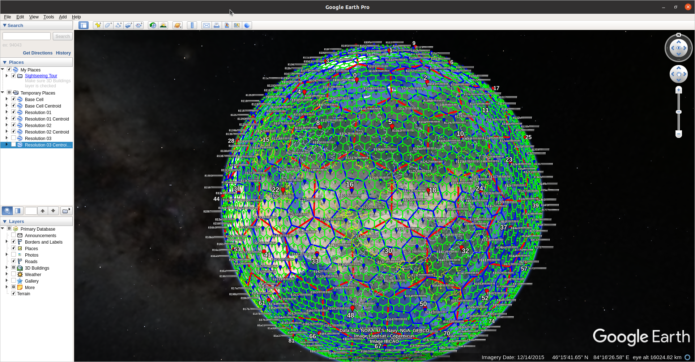

#  Visualizing H3 on Google Earth

Sometimes it's hard to debug H3 index without visualizing them, so I've created this small tool for this purpose. It requires you to download and intall the [Google Earth Pro on desktop](https://www.google.com/earth/versions/) app on your local. Then you can download this [Uber_H3.kml](../data/Uber_H3.kml) file and open it in Google Earth desktop app. Enjoy!

