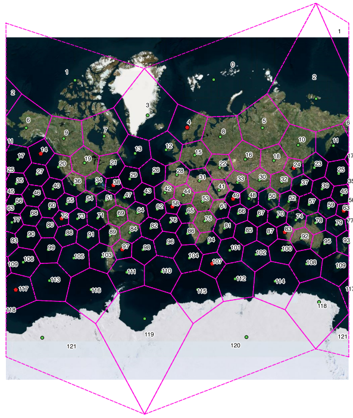
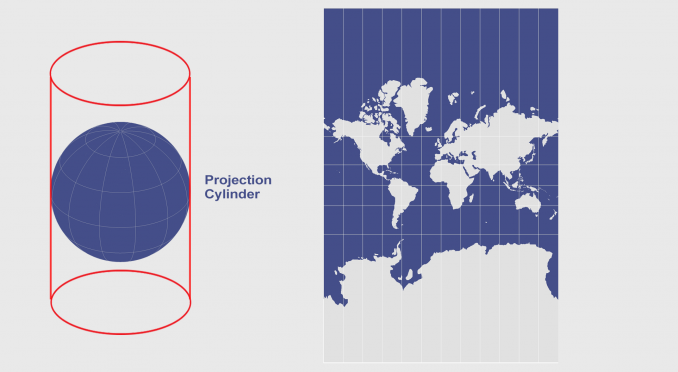

# Mapping H3 index in Web Mercator Projection

How does it look like if we map H3 index in [Web Mercator projection](https://en.wikipedia.org/wiki/Web_Mercator_projection)?

As you can see, the hexagons who close to the North Pole and South Pole become discrete. Just as the cylindrical projection described in [here](https://gisgeography.com/cylindrical-projection/). Both the North Pole point and South Pole point become a circle area.

