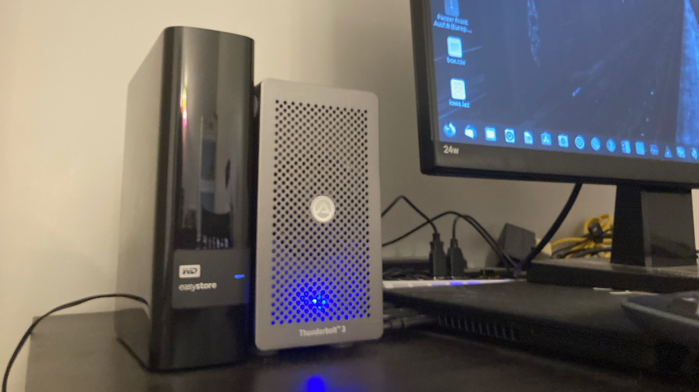

# [](#header-1)Building CUDA 10, Tensorflow2.0, PyTorch for development environment



## [](#header-2)PART I - Purpose

### [](#header-3)Why I need a machine like this?

Three reasons in short: 

1) For owning a personal computing suite with a great compute power, and also both affordable and upgradeable in the future;

2) Geospatial data will finally be increased to the size that enough for running Machine Learning (ML) algorithm; Most ML algorithm requires GPU acceleration; ML technicals will also blur the boundaries between geospatial data and Non-geospatial data, which will provide a chance for non-geospatial rookies to access and training geospatial data for their own business purpose without knowing some advanced geospatial concept.

3) We could train a person to have spatial thinking and concept, why not train a machine to have spatial thinking and concept? Some ML projects already started by using Google Compute Engine, which means in the future I could also extend my geospatial experience and deploy some of my demo in Google Compute Engine (GCE), then I need an identity development environment to the GCE built in environment.

### [](#header-3)Is this the right time for investment?

Regarding the cost and technology, the market of laptop have changed a lot in the past 5 years:

1) Apple dropped their Nvidia support in MacOS Mojave, and also abandoned OpenCL, and Metal became the only GPGPU framework that could work on a Mac computer. Metal is owned by Apple, Inc. It can only be installed and executed on Mac OS X 10.14+.

2) With the technology improvement in the Gaming laptop field, external GPU and PCI device has became popular in the market because their portability, cheaper price, smaller size and easy to use.

3) Some laptops started to support one or two Thunderbolt 3.0 port with an affordable price in order to occupy the PC market as much as they can, and this movement is leading by Apple, who has made their newer Macbook model equipped with four Thunderbolt 3.0 port!

### [](#header-3)My investment choice (Hardware requirements)

1) A laptop can support both data exchange and power delivery through Thunderbolt 3.0, and it's better to be a full speed Thunderbolt 3.0. I picked up Thinkpad T470 at $499, and upgraded its memory from 8G to 16G by adding a $40 RAM from Amazon.

2) My eGPU is actually a PCI expansion box (Akiio Node Lite $200), which is not specifically made for GPUs, but many people figured out that it could be used to add a second GPU card or SSD card to your laptop.

3) An lower end low profile Nvidia graphic card at least support CUDA capability to 3.5+, and My choice is Nvidia GeForce GTX750 Ti, and I got it from Taobao.com in China ($80), it has CUDA capability at 5.0.

4) If you are planning to just learn CUDA, ML skills under Linux environment, there will be no software license fees! ($0)

*Total: $499 + $40 + $200 + $80 + $0 = $819

While if choose to use GCE, you'll end up with a VM instance for minimum $282 per month, considering the learning curve for CUDA and ML is unknown, using GCE to learn GPU acceleration or train ML models is not a good choice compared with our life long solution for learning!

## [](#header-2)PART II - Just do it!

### [](#header-3)What do I need to install?

Considering one part of my work in the future that I am going to use GPU to accelerate some Hexagon interpolation algorithm using Uber H3 index. For me, to have GPU computing power is the highest priority, so CUDA 10.0 is a must to have. While since at the time when writing this article, Tensorflow 2.0 only supports CUDA 10.0 and the highest CUDA version on GCE is also 10.0. I also installed tensorflow 2.0 on my laptop to let it has same capability as current GCEs except they have better GPUs. Although CUDA 10.0 is not the latest technology, it's more stable!

So the decided software stack is Ubuntu 18.04LTS + CUDA 10.0 + Tensorflow2.0 + Uber H3 + GDAL 2.x

Summary:

OS: Ubuntu 18.04LTS

C Compiler: gcc/g++-7 (Default)

CUDA: 10.0

Tensorflow: 2.0

GDAL: 2.x (Could be install together with QGIS 3.4 LTS)

Uber H3: 3.4.3 (Need to be compiled locally)

Python: 2.7 and 3.6 (Default)

Pip:  pycuda, numba, pyopencl, tensorflow-gpu, pyTorch, h3, shapely, pandas, numpy

### [](#header-3)Procedures

**1)** Install Ubuntu 18.04LTS from LiveUSB

[LiveUSB]: https://tutorials.ubuntu.com/tutorial/tutorial-create-a-usb-stick-on-macos#0	"How to make a LiveUSB on Mac"

**2)** Install Nvidia Graphic Card driver in the Software & Update ==> Additional Drivers

[Additional Drivers]: https://www.linuxbabe.com/ubuntu/install-nvidia-driver-ubuntu-18-04	"How to install GPU drivers"

**3)** Download CUDA 10.0 from https://developer.nvidia.com/cuda-10.0-download-archive, choose Linux ==> x86_64 ==> Ubuntu ==> 18.04 ==> runfile (local), then install it in terminal:

```shell
$ sudo shcuda_10.0.130_410.48_linux.run
```

Then just follow the command prompts but don't install driver if you already installed it before this step.

**4)** Install Tensorflow 2.0

Download `libcudnn7_7.6.4.38-1+cuda10.0_amd64.deb`, `libcudnn7-dev_7.6.4.38-1+cuda10.0_amd64.deb`, ` libcudnn7-doc_7.6.4.38-1+cuda10.0_amd64.deb` from https://developer.nvidia.com/rdp/cudnn-archive, then

```shell
$ sudo dpkg -i libcudnn7_7.6.4.38-1+cuda10.0_amd64.deb
$ sudo dpkg -i libcudnn7-dev_7.6.4.38-1+cuda10.0_amd64.deb
$ sudo dpkg -i libcudnn7-doc_7.6.4.38-1+cuda10.0_amd64.deb
$ wget https://developer.download.nvidia.com/compute/cuda/repos/ubuntu1804/x86_64/cuda-repo-ubuntu1804_10.0.130-1_amd64.deb
$ sudo dpkg -i cuda-repo-ubuntu1804_10.0.130-1_amd64.deb
$ sudo apt-key adv --fetch-keys https://developer.download.nvidia.com/compute/cuda/repos/ubuntu1804/x86_64/7fa2af80.pub
$ sudo apt-get update
$ wget http://developer.download.nvidia.com/compute/machine-learning/repos/ubuntu1804/x86_64/nvidia-machine-learning-repo-ubuntu1804_1.0.0-1_amd64.deb
$ sudo apt install ./nvidia-machine-learning-repo-ubuntu1804_1.0.0-1_amd64.deb
$ sudo apt-get update
$ sudo apt --fix-broken install
$ sudo apt-get install cuda-cublas-dev-10-0
$ sudo apt-get install -y --no-install-recommends libnvinfer5=5.1.5-1+cuda10.0 libnvinfer-dev=5.1.5-1+cuda10.0
$ sudo apt-key del 7FA2AF80
$ sudo rm -f /etc/apt/sources.list.d/nvidia-machine-learning.list
$ sudo rm -f /etc/apt/sources.list.d/cuda.list
$ sudo apt-get update
$ sudo apt-get autoclean
$ sudo apt-get autoremove
```

Then add following content to `~/.profile`

```shell
# set PATH for cuda installation
if [ -d "/usr/local/cuda/bin" ]; then
    export CUDA_HOME=/usr/local/cuda
    export PATH="$CUDA_HOME/bin:$PATH"
    export LD_LIBRARY_PATH="$CUDA_HOME/lib64:$LD_LIBRARY_PATH"
    # set PATH for numba installation
    export NUMBA_NVVM="$CUDA_HOME/nvvm"
    export NUMBA_LIBDEVICE="$CUDA_HOME/nvvm/libdevice"
fi
```

**5)** Configure pip

```shell
$ sudo apt-get install python3-pip python-pip
$ echo "alias python=python3" >> ~/.bash_aliases
$ echo "alias pip=pip3" >> ~/.bash_aliases
```

Then add following content to `~/.profile`

```shell
# include .bash_aliases if it exists
if [ -f "$HOME/.bash_aliases" ]; then
    . "$HOME/.bash_aliases"
fi
```

**6)** Compile H3 locally

```shell
$ sudo apt-get install git graphviz clang-tidy cmake make gcc libtool clang-format cmake-curses-gui lcov doxygen
$ git clone https://github.com/uber/h3
$ cd h3-master
$ cmake .
$ make
$ sudo make install
```

**7)** Install QGIS 3.4:  https://qgis.org/en/site/forusers/alldownloads.html#debian-ubuntu