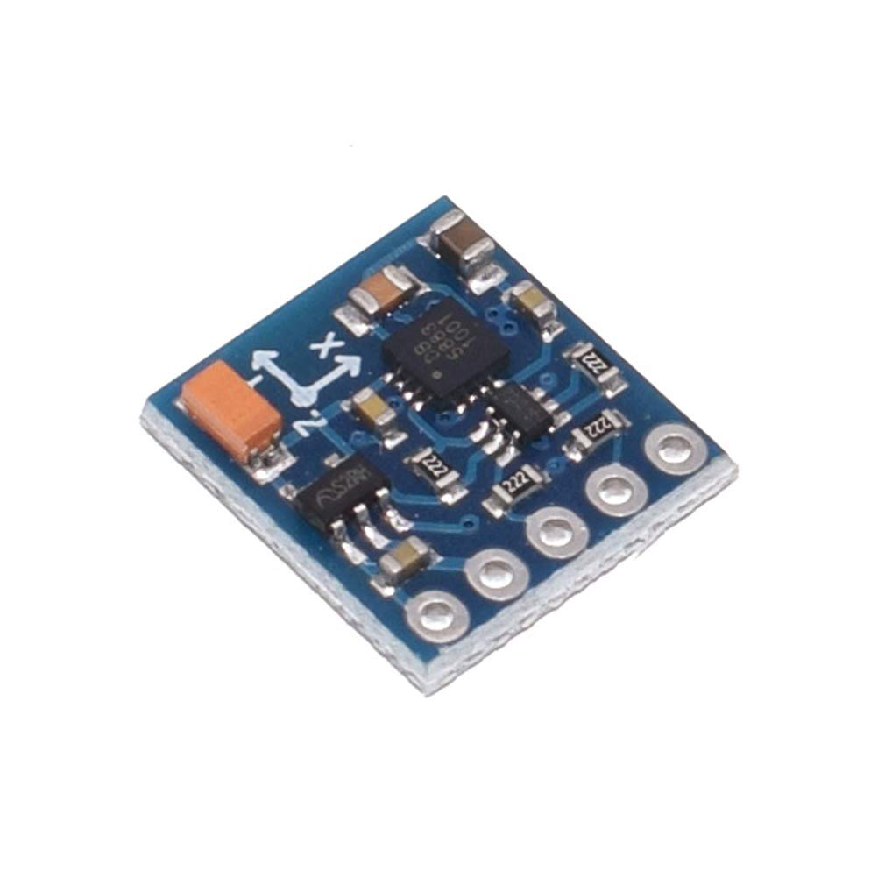

# [](#header-1)Python driver for the QMC5883L 3-Axis Magnetic Sensor

Developed for the **Raspberry Pi**, requires the **python-smbus** package
to access the I2C bus.



Usage example:

```python
import raspy_qmc5883l

sensor = raspy_qmc5883l.QMC5883L()
m = sensor.get_magnet()
print(m)
```

The object constructor accepts some arguments, e.g. you can pass this one to
switch the output range to 8 Gauss, for very strong magnetic fields which
can otherwise overflow the sensor:

```python
sensor = raspy_qmc5883l.QMC5883L(output_range=raspy_qmc5883l.RNG_8G)
```

The class constructor will initialize the sensor and put it into continuous
read mode, where a new reading is available into the registers at the Output
Data Rate (default is 10 Hz). To save power you can put the sensor in standby
mode calling the **QMC5883L.mode_standby()** method. To wakeup the sensor, just
call the **QMC5883L.mode_continuous()** once, and start getting values.

## [](#header-2)Module installation

Installing from [PyPI](https://pypi.org/project/raspy-qmc5883l/)

```bash
$ pip install raspy-qmc5883l
```

## [](#header-2)Output Range Scale

The sensor produces values as 16 bit signed integers, i.e. 
numbers between -32768 and 32767. The field range is 
programmable with two different values: +/-2 gauss or +/-8 
gauss. The natural magnetic field produced by the Earth is 
generally between 0.25 and 0.65 gauss, so the 2 G range is 
preferable in natural environment. You can expect readings in 
the range +/-4000 (about 0.2 gauss).

If you operate in presence of strong magnetic fields, you can 
experience reading overflows (over the 16 bit capabilities), in 
this case the driver will generate a warning and you can try to 
initialize the sensor in 8 gauss range, as seen above.

## [](#header-2)Adjust for Magnetic Declination

If you want that the **QMC5883L.get_bearing()** method return 
the current compass bearing adjusted by the *magnetic declination*,
you have to set the **QMC5883L.declination** property.

```python
sensor.get_bearing()
# 87.20
sensor.declination = 10.02
sensor.get_bearing()
# 97.22
```

The magnetic declination changes depending on the place and upon 
time; there are some web services which give your current value.

## [](#header-1)Calibration

Values returned by the magnetic sensor may be altered by several 
factors, like misalignment of sensor's axes, asimmetries in the 
sensor sensitivity, magnetic fields and magnetic (ferrous) 
metals in the proximity of the sensor.

Into the **[calibration directory](calibration/)** there are 
some tools that can be used to perform a simple 2D calibration 
using the Earth's magnetic field.

Once you have obtained the 3x3 calibration matrix, you can set 
it into the driver using the **calibration** property and have 
it automatically applied when calling the **get_bearing()** 
function.

```python
sensor.calibration = [[1.030, 0.026, -227.799],
                      [0.0255, 1.021, 1016.442],
                      [0.0, 0.0, 1.0]]
sensor.get_bearing()
```

## [](#header-1)Documentation

Read the **[module source code](https://github.com/yanfuzhou/raspy-qmc5883l/blob/master/raspy_qmc5883l/__init__.py)** and the
**[chip Datasheet](https://github.com/yanfuzhou/raspy-qmc5883l/blob/master/doc/QMC5883L-Datasheet-1.0.pdf)**.