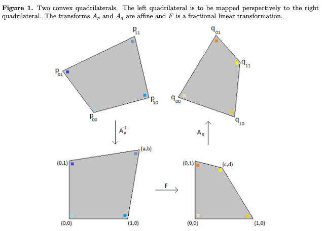

# Quadrilateral Transformation

Quadrilateral Transformation is a popular technic for reshaping an image. In geometry a quadrilateral is a four-sided polygon, having four edges (sides) and four corners (vertices). The word is derived from the Latin words quadri, a variant of four, and latus, meaning "side". It is also called a tetragon, derived from greek "tetra" meaning "four" and "gon" meaning "corner" or "angle", in analogy to other polygons.

refrence:

- [1] [https://rethunk.medium.com/perspective-transform-from-quadrilateral-to-quadrilateral-in-swift-using-simd-for-matrix-operations-15dc3f090860](https://rethunk.medium.com/perspective-transform-from-quadrilateral-to-quadrilateral-in-swift-using-simd-for-matrix-operations-15dc3f090860)
- [2] [https://en.wikipedia.org/wiki/Quadrilateral](https://en.wikipedia.org/wiki/Quadrilateral)

Here is an interactive live demo:

<iframe
  src="../webpages/QuadrilateralTransformation/"
  style="width:640px; height:480px;">
</iframe>

View [source code](https://github.com/yanfuzhou/yanfuzhou.github.io/tree/master/webpages/QuadrilateralTransformation)