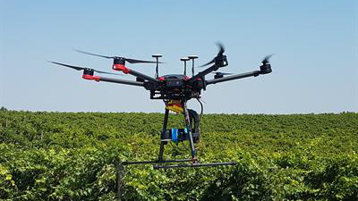

# Direct georeferencing UAV breeding RGB photos

In digital farming world, UAV enables measuring with high spatial and temporal resolution capable of generating useful information for plant breeding programs.

Different types of imaging systems for remote sensing of crops are being used on UAS platforms. Some of the cameras used are RGB, multispectral, hyperspectral, thermal cameras, and low cost consumer grade cameras modified to capture near infrared (NIR). Consumer grade digital cameras are widely used as the sensor of choice due to their low cost, small size and weight, low power requirements, and their potential to store thousands of images.

reference: [https://plantmethods.biomedcentral.com/articles/10.1186/s13007-016-0134-6](https://plantmethods.biomedcentral.com/articles/10.1186/s13007-016-0134-6)

---

Before each flight, the gyro need to be calibrated to make sure the camera could get a good view angle (facing to the ground). When flying UAV, the pilot also need to make sure there are always overlays between each photos. Since there are ovelays between each UAV images, they can be stiched together easily. 

Image stitching is a pixel based algorithm, it scans similar pixel values between two images and then expand the canvas to include more pixles, at the same time it's also doing affine transformation to rotate and zoom on images and then stich them together. Here is an example of UAV stiched images.

There are several disadvantages of pixel based image stitching:

- (1) high resolution images are large and require expensive computations, so the stitching process can take a very long time;
- (2) The stitching quality can affected by the image itself, which could be impacted by many factors, such as exposure time, environment light, camerca filter, etc.;
- (3) It's hard to predict the stitching result unless being actually stitched.

Instead of looking into how to optimize existing pixel based stitching solution. I explored a new way for stitching UAV images, which is stitching them by coordinates, also known as direct georeferencing. By downsizing each UAV images, the direct georeferencing method could quickly identify image quality issues and predict the pixel based stitching result. Besides, unlike most pixel based stitching programs, the direct georeferencing implementation can deployed into a single webpage, which makes it more user friendly!

One of the key ideas of the direct georeferencing method is using [Quadrilateral Transformation](./QuadrilateralTransformation.md) to stitch image corners. We can use the gyro data to built a [rotation matrix](https://en.wikipedia.org/wiki/Rotation_matrix) to get accurate 4 corner coordinates of an image. Then the quadrilateral transformation is used to stretch the image 4 corners to the place.

Here is a direct georeferencing live demo:

<iframe
  src="../webpages/UavDirectGeoreferencing/example1/demo/"
  style="width:100%; height:640px;">
</iframe>

View [source code](https://github.com/yanfuzhou/yanfuzhou.github.io/tree/master/webpages/UavDirectGeoreferencing/example1/demo)