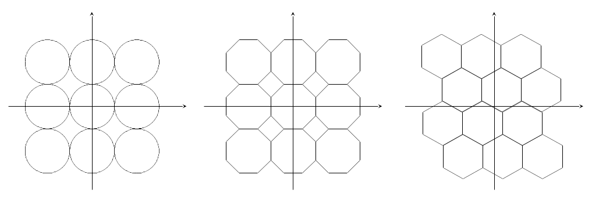
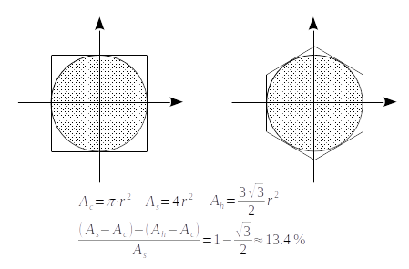
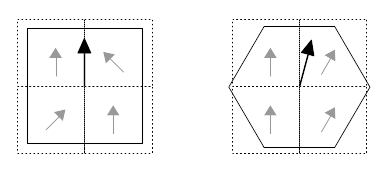
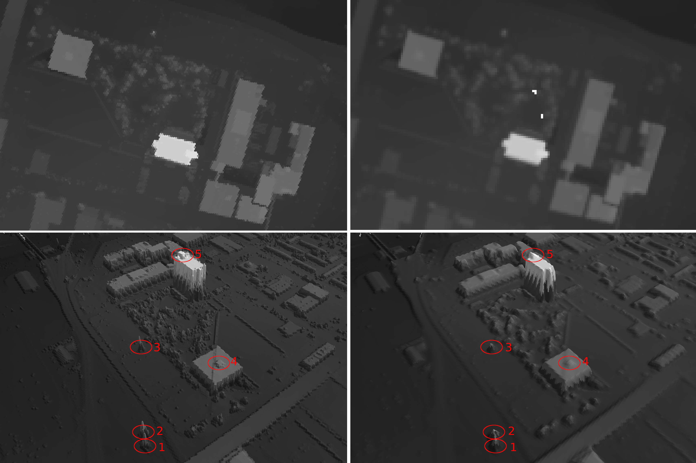
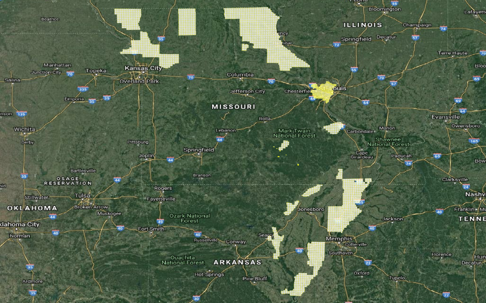

# HEXAGONAL DIGITAL SURFACE MODEL

Using Icosahedral-based Geodesic Discrete Global Grid To Build Hexagonal Digital Surface Model

---
# Project Background

Lidar Point Cloud (LPC) data is a popular source for building high precision and high resolution (>= 1/9 arc-second approximately 3m) 
digital elevation model/digital surface model (DEM/DSM). Due to current limitations of image data structure and image rendering architecture, 
not many projects have done massive production of high resolution and high precision **Hexagonal Digital Surface Model (HDSM)**. 
This project targeted at above challenges and tried to create massive production of HDSM by using 
[USGS's public LIDAR dataset](https://www.sciencebase.gov/catalog/item/4f70ab64e4b058caae3f8def).

## Why using hexagonal grid?

Using hexagonal grid to fill a 2d plane has three major advantages over using square/circle/octagon grid: 

1. Hexagonal grid could fill a 2d plane without creating gaps or overlaps  

2. For the interpolation process, hexagonal grid desires 13.4% less sampling points than square grid requires  

3. For building drainage networks on an elevation model, hexagonal grid could maintain streamflow direction better than square grid 
(See paper: [De Sousa, 2006](http://citeseerx.ist.psu.edu/viewdoc/download?doi=10.1.1.485.7483&rep=rep1&type=pdf))  

*For more detailed information, please check [Why hexagons?](https://pro.arcgis.com/en/pro-app/tool-reference/spatial-statistics/h-whyhexagons.htm)

# Project Details

In order to test our workflow and strategy, and before we do massive produce of HDSM dataset at country level, 
an experiment is taking out in St Louis, MO. The project will continue add more coverage area and 
adjust its workflow based on experiment feedback. The experiment result showed a significant improvement.

## Experiment Locations

[Enlarge](../images/s2_aoi_01.png)

| Location | Latitude  | Longitude  |
|----------|-----------|------------|
| No.1     | 38.621384 | -90.200049 |
| No.2     | 38.621325 | -90.199923 |
| No.3     | 38.620376 | -90.198828 |
| No.4     | 38.620165 | -90.200145 |
| No.5     | 38.618981 | -90.198371 |

## Result comparison and analysis

[Enlarge](../images/s2_aoi_01_hexagon_vs_grid.png) 

(i) upper left - top view of the experimental area HDSM, hexagon diameter: 2.7m
(ii) bottom left - 3D view of the experimental area HDSM, location 1,2,3 are high-voltage line towers, 
location 4,5 are building roof structures
(iii) upper right - top view of the experimental area DSM (generated by [PDAL](https://pdal.io/)), grid resolution: 1/9 arc-second 
(iv) bottom right - 3D view of the experimental area DSM, both location 1,2,3 and location 4,5 are not detectable. 

[Sample data dowload](../data/USGS_LPC_MO_StLouis_2017_7433_4277_LAS_2018.tif) 

## Dataset covered area

Currently HDSM dataset only covers some locations in Missouri and Arkansas, while we'll add as many coverage as we can in the future. 

[Enlarge](../images/s2_coverage_01.png)

