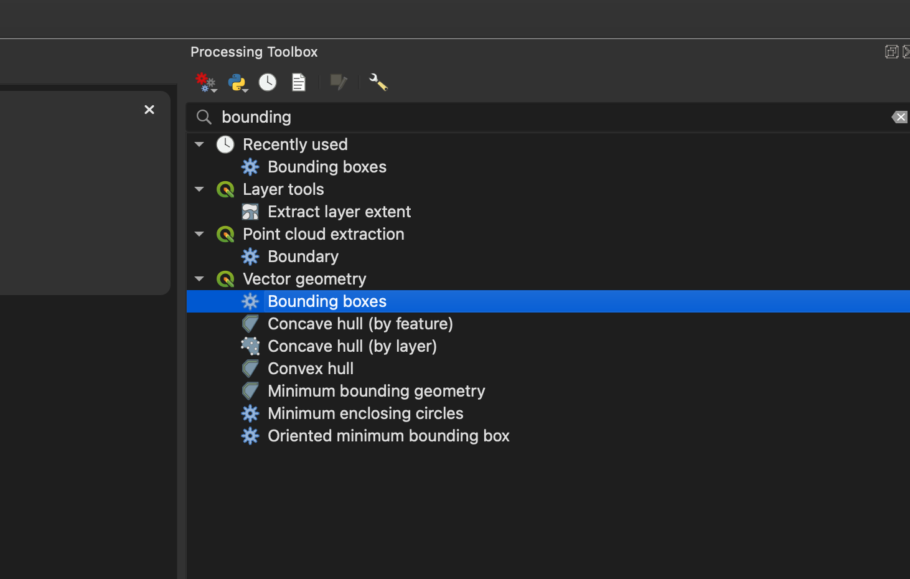
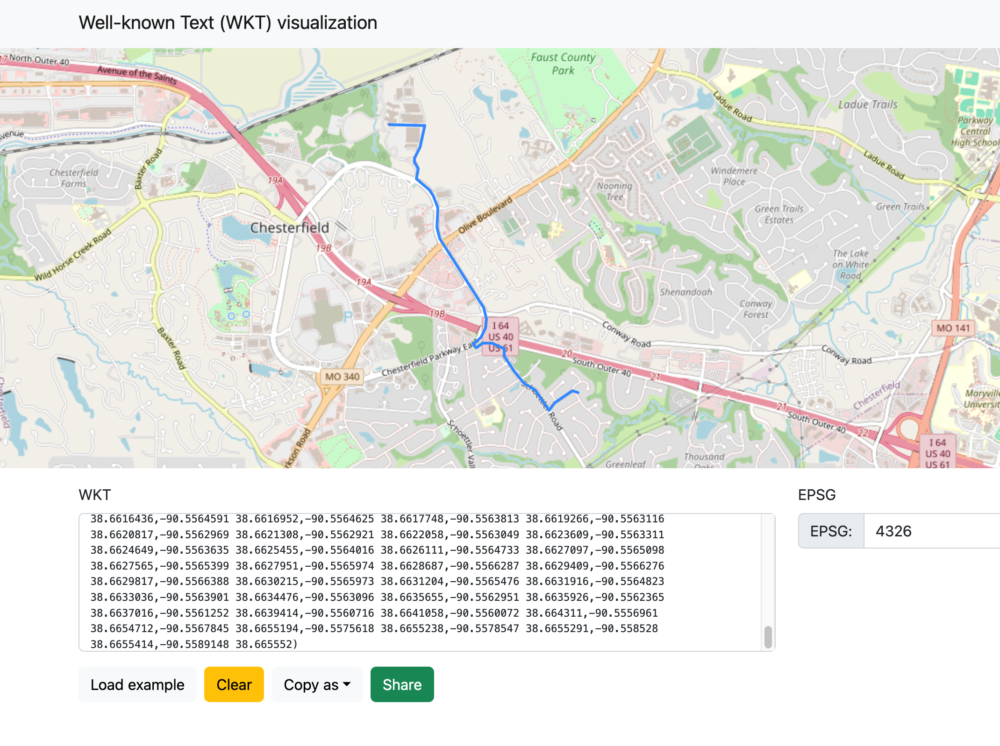

# Learning pgRouting (A*, Dijkstra) in PostGIS

## Environment setup

- OS: macOS Big Sur version 11.7.11
- Database: [PostgresSQL 18](https://postgresapp.com/downloads.html)

------

### Tools setup
Install osm2pgsql and osm2pgrouting through MacPorts, download and compile [osmconvert](https://wiki.openstreetmap.org/wiki/Osmconvert)

```bash
$ sudo port install osm2pgsql
$ sudo port install osm2pgrouting
$ wget -O - http://m.m.i24.cc/osmconvert.c | cc -x c - -lz -O3 -o osmconvert
```
Install `psql`

```bash
$ sudo port install postgresql17
$ sudo port select --set postgresql postgresql17
```
### Download data
Download missouri OSM data from here [missouri-260210.osm.pbf](https://download.geofabrik.de/north-america/us/missouri.html)

------

## Use osm2pgsql to ingest data for routing visulization
```bash
$ osm2pgsql -c -d yanfuzhou -U yanfuzhou -H localhost -S /opt/local/share/osm2pgsql/default.style --prefix mo_osm_ missouri-260210.osm.pbf
```

------


## Use state TIGER data to get city area bounding box

### Steps for generate the shell script for loading state TIGER data
```bash
$ psql -U yanfuzhou -h localhost -d yanfuzhou -A -t -c "SELECT Loader_Generate_Script(ARRAY['MO'], 'sh')" > ~/Desktop/gisdata/state_load_MO.sh;
```

After `state_load_MO.sh` being generated, open it in a text editor, and modify it like the one [attached in here](./state_load_MO.sh), then run the script like following:

```bash
$ cd ~/Desktop/gisdata
$ chmod +x ./state_load_MO.sh
$ ./state_load_MO.sh
```

Open [QGIS3](https://qgis.org/download/), then find the city area and select the feature, then use tool 'Vector Geometry' ==> 'bounding box to' generate the bounding box of the city area, you can later to get the bounding box coordinates from the properties of the bounding box layer



In this example, the bounding box coordinates are `-90.6791809999999998,38.6105919999999969,-90.4855349999999987,38.6924240000000026`

refer: [QGIS3 Tutorial](https://www.qgistutorials.com/en/)

------

## Use osmconvert to extract out the city area from state data for routing

```bash
$ osmconvert missouri-260210.osm.pbf -b=-90.6791809999999998,38.6105919999999969,-90.4855349999999987,38.6924240000000026 --complete-ways -o=mo-chesterfield.osm.pbf
$ osmconvert mo-chesterfield.osm.pbf --drop-author --drop-version --out-osm -o=mo-chesterfield_reduc.osm
```

intermediate data in this step [mo-chesterfield_reduc.osm](./mo-chesterfield_reduc.osm)

------

## Use osm2pgrouting to generate edge-node graph for routing

```bash
$ osm2pgrouting --f mo-chesterfield_reduc.osm --conf /opt/local/share/osm2pgrouting/mapconfig.xml --schema public --prefix mo_chesterfield_osm_ --dbname yanfuzhou --username yanfuzhou -h localhost -p 5432 -W "Zyf860624;" --addnodes --attributes --tags --chunk 20000 --clean
```

------

## Run following SQL in database

### Generte a materialized view for way types lookup

```sql
CREATE MATERIALIZED VIEW public.osm_way_tag_id_value_lookup AS
SELECT a.tag_id, b.tag_value FROM
	(SELECT osm_id, tag_id FROM public.mo_chesterfield_osm_ways) AS a
INNER JOIN
	(SELECT osm_id, tag_value FROM public.osm_ways) AS b
	ON a.osm_id = b.osm_id
GROUP BY a.tag_id, b.tag_value
ORDER BY a.tag_id ASC;
```

### Run following query to get the geometry of the route

Suppose our starting point is `-90.541574, 38.6462956` and our destination point is `-90.5589148, 38.665552`. 

*In real case, the starting coordinates may come from the GPS on a smart phone and the destination coordinates can be get from the address, by setting up [the geocode search using TIGER address data in PostGIS](https://postgis.net/docs/Geocode.html)

*Here we are using `pgr_astar` algorithim, you can also change it to [pgr_dijkstra](https://access.crunchydata.com/documentation/pgrouting/latest/pgr_dijkstra.html), while `pgr_dijkstra` will be a lot slower than `pgr_astar`, however it does always give us the shortest path.

*Note: you can change `ST_AsGeoJSON` to `ST_AsText`, by doing this, you can get a WKT string as your result.

```sql
SELECT
    ST_AsGeoJSON(ST_AddPoint(ST_AddPoint(ST_LineMerge(ST_Union(ways.geom)), ST_MakePoint(-90.541574, 38.6462956), 0), ST_MakePoint(-90.5589148, 38.665552), -1)) AS geom
    -- SUM(route.cost) AS total_cost
FROM
	pgr_astar(
		'SELECT id, source, target, cost, reverse_cost, x1, y1, x2, y2 FROM public.mo_chesterfield_osm_ways WHERE tag_id IN 
		(SELECT tag_id FROM public.osm_way_tag_id_value_lookup WHERE tag_value IN (''primary'', ''secondary'', ''tertiary'', ''service'', ''residential''))',
		(SELECT id FROM public.mo_chesterfield_osm_ways_vertices_pgr ORDER BY geom <-> ST_SetSRID(ST_Point(-90.541574, 38.6462956), 4326) LIMIT 1),
		(SELECT id FROM public.mo_chesterfield_osm_ways_vertices_pgr ORDER BY geom <-> ST_SetSRID(ST_Point(-90.5589148, 38.665552), 4326) LIMIT 1),
		directed := true,
		heuristic := 5,
		factor := 1,
		epsilon := 1
	) AS route
JOIN
    public.mo_chesterfield_osm_ways AS ways ON route.edge = ways.id
GROUP BY
    route.edge <> -1; -- Exclude the final node which has no edge
```

If you choose to export the routing geometry as WKT, you'll get following string as the query result

```text
LINESTRING(-90.541574 38.6462956,-90.542114 38.6464699,-90.5421596 38.6464141,-90.5422197 38.6463546,-90.5423651 38.6462604,-90.5428329 38.6460141,-90.5433265 38.6457711,-90.5435845 38.6456513,-90.5437539 38.645546,-90.5438263 38.6454988,-90.543896 38.645462,-90.543947 38.6454109,-90.5439912 38.6453512,-90.5440543 38.6452024,-90.5442625 38.6450547,-90.5444409 38.6452826,-90.5454389 38.6463974,-90.5454832 38.6464374,-90.5455643 38.646514,-90.5456645 38.6465748,-90.5456797 38.6465851,-90.5457772 38.6466266,-90.5458995 38.6466753,-90.5460924 38.6467476,-90.5461783 38.6467798,-90.5462655 38.6468127,-90.5463269 38.6468383,-90.5464115 38.6468792,-90.5465026 38.6469236,-90.5465831 38.6469822,-90.5468841 38.6472852,-90.5472783 38.6477167,-90.5474887 38.6479462,-90.5476711 38.6481451,-90.547958 38.648442,-90.5480021 38.6484876,-90.5480354 38.6485325,-90.5482997 38.6488508,-90.5483426 38.6489346,-90.5483725 38.6490046,-90.5483855 38.6490351,-90.5484055 38.6491379,-90.5484141 38.649292,-90.5483969 38.6494797,-90.5486914 38.6495795,-90.5495249 38.6498341,-90.5496536 38.6498676,-90.5497609 38.6498843,-90.5498897 38.6498885,-90.5500184 38.6498801,-90.5501378 38.6498691,-90.5502464 38.649852,-90.5503553 38.649825,-90.5505738 38.6497414,-90.5507835 38.6496101,-90.5508425 38.6495714,-90.5509122 38.6495504,-90.5509873 38.6495462,-90.5510409 38.6495588,-90.5510892 38.6495797,-90.5511429 38.6496258,-90.5511983 38.6497594,-90.5509559 38.649921,-90.5509308 38.649942,-90.5506277 38.6501952,-90.5505522 38.6502582,-90.5504389 38.6503833,-90.5502517 38.6506541,-90.550126 38.6509612,-90.5500872 38.651073,-90.5500795 38.6510905,-90.5500616 38.6512155,-90.5500601 38.6512256,-90.5500433 38.6514277,-90.5500448 38.6515955,-90.5500479 38.6516216,-90.5500723 38.6518257,-90.5500765 38.651861,-90.5500872 38.6519509,-90.5501066 38.6520084,-90.5501661 38.652185,-90.5501941 38.6522377,-90.5502906 38.6524197,-90.5504631 38.6525766,-90.5507294 38.6529334,-90.5513519 38.6537051,-90.5514297 38.6538015,-90.5515574 38.6539592,-90.5516575 38.6540827,-90.551701 38.6541365,-90.5517395 38.654184,-90.5517939 38.6542493,-90.5518225 38.6542835,-90.551951 38.6544377,-90.5521365 38.6546601,-90.5522968 38.6548524,-90.5524884 38.6550823,-90.5528049 38.6554618,-90.5529082 38.6555857,-90.5532058 38.6559427,-90.5532333 38.6559756,-90.5533677 38.6561368,-90.5535191 38.6563184,-90.553555 38.6564569,-90.553584 38.6564918,-90.5537705 38.6567159,-90.5538819 38.6568582,-90.5539019 38.6568845,-90.5539453 38.656939,-90.5540233 38.6570287,-90.5540691 38.6570887,-90.5541073 38.6571388,-90.5541492 38.6572013,-90.554268 38.6573654,-90.5544049 38.6576375,-90.5544651 38.6577996,-90.5544821 38.6578453,-90.5545392 38.6581431,-90.5545502 38.6583879,-90.5545519 38.6584284,-90.5545086 38.6587964,-90.5544928 38.6591571,-90.5544928 38.6592478,-90.5544928 38.6592978,-90.5545024 38.6594616,-90.5545079 38.6595561,-90.5545262 38.6596219,-90.5545749 38.6597964,-90.5545858 38.6598357,-90.5546583 38.660047,-90.5547002 38.6601197,-90.5547355 38.660181,-90.5548174 38.6603171,-90.5549145 38.6604782,-90.5551138 38.660704,-90.5552683 38.6608648,-90.5554636 38.6610322,-90.555661 38.6611729,-90.5558881 38.6613053,-90.5560661 38.6613973,-90.5561869 38.6614548,-90.5563773 38.6615789,-90.5564323 38.6616323,-90.5564397 38.6616436,-90.5564591 38.6616952,-90.5564625 38.6617748,-90.5563813 38.6619266,-90.5563116 38.6620817,-90.5562969 38.6621308,-90.5562921 38.6622058,-90.5563049 38.6623609,-90.5563311 38.6624649,-90.5563635 38.6625455,-90.5564016 38.6626111,-90.5564733 38.6627097,-90.5565098 38.6627565,-90.5565399 38.6627951,-90.5565974 38.6628687,-90.5566287 38.6629409,-90.5566276 38.6629817,-90.5566388 38.6630215,-90.5565973 38.6631204,-90.5565476 38.6631916,-90.5564823 38.6633036,-90.5563901 38.6634476,-90.5563096 38.6635655,-90.5562951 38.6635926,-90.5562365 38.6637016,-90.5561252 38.6639414,-90.5560716 38.6641058,-90.5560072 38.664311,-90.5556961 38.6654712,-90.5567845 38.6655194,-90.5575618 38.6655238,-90.5578547 38.6655291,-90.558528 38.6655414,-90.5589148 38.665552)
```
Now you can visualize the result on map via [WKT Map](https://wktmap.com/)



If you choose to export your result using `GeoJSON` format, you can also visualize the result in QGIS3 ([geojson result can be download here](./route_check.geojson))


------

## Further studies, thoughts
### osm2po routing engine based on pgRouting and OSM map
Doc: [osm2po](https://osm2po.de/)

- osm2po is both, a converter and a routing engine.
- osm2po's converter parses OpenStreetMap's XML-Data and makes it routable.
- osm2po is able to convert large sets like europe.osm.
- osm2po generates sql files for PostGIS, compatible with pgRouting and Quantum GIS.
- osm2po creates compact topology/graph files for the integrated routing engine.
- osm2po contains a simple HTTP routing server which returns CSV, GeoJson, or starts the TestUI.
- osm2po runs under Windows, Unix and Mac. Just make sure you have Java 8+ installed.
- osm2po does not depend on foreign Java libraries.
- osm2po's core is just one file. No installation is needed.

### Thoughts
A Restful API can be built by taking the parameters needed for `pgr_astar` from the user, and then perform the geocode search and routing search and then return the routing result as geometry back to the user, then the user can have a Typescript/Javascript UI frontend (such as [OpenLayers](https://openlayers.org/)) to visualize the result. In addtion, if the frontend is built on [React](https://react.dev/)/[Angular](https://angular.dev/) framework and deployed to a smart phone using such as [Apache Cordova](https://cordova.apache.org/), we can also track whehter the user is off the route through the GPS on the phone.

