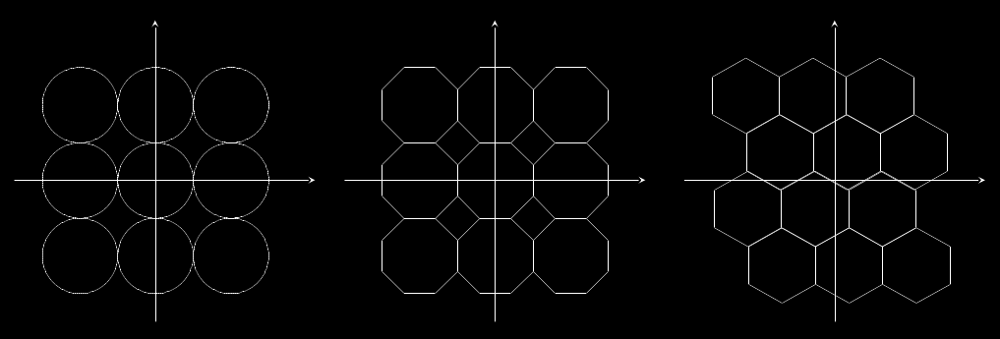
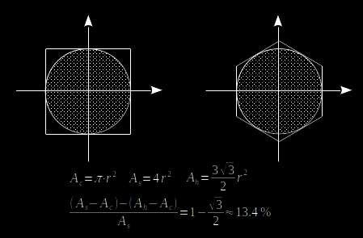
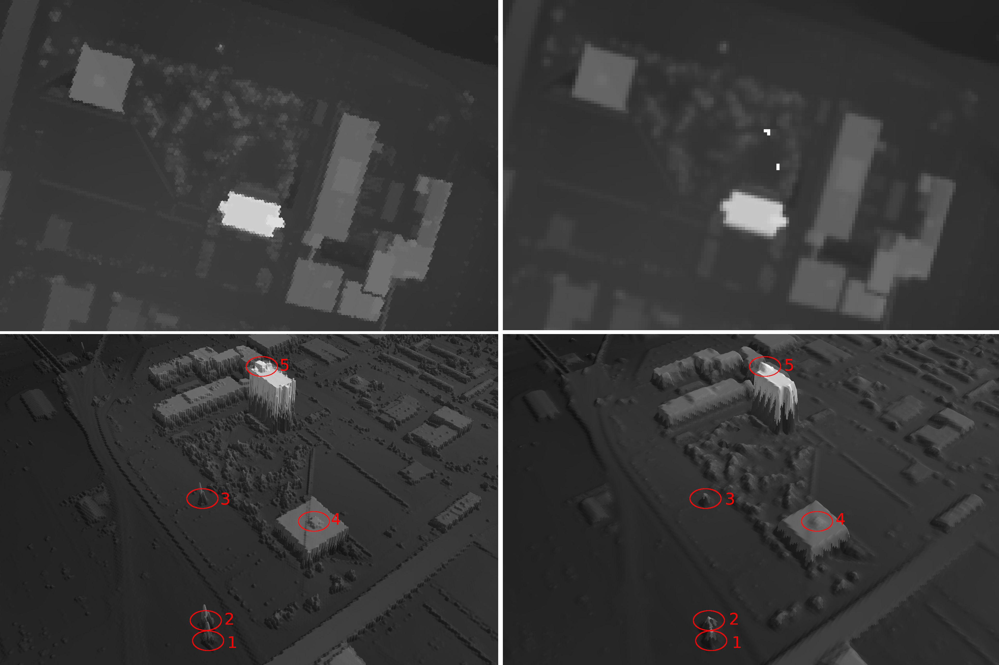

# Project Background

Lidar Point Cloud (LPC) data is a popular source for building high precision and high resolution (>= 1/9 arc-second approximately 3m) 
digital elevation model/digital surface model (DEM/DSM). Due to current limitations of image data structure and image rendering architecture, 
not many projects have done massive production of high resolution and high precision **Hexagonal Digital Surface Model (HDSM)**. 
This project targeted at above challenges and tried to create massive production of HDSM by using 
[USGS's public LIDAR dataset](https://www.sciencebase.gov/catalog/item/4f70ab64e4b058caae3f8def).

## Why using hexagonal grid?

Using hexagonal grid to fill a [2d plane](https://www.mathsisfun.com/geometry/plane.html) has three major advantages over using square/circle/octagon grid: 

1. Hexagonal grid could fill a 2d plane without creating gaps or overlaps  

2. For the interpolation process, hexagonal grid desires 13.4% less sampling points than square grid requires  

3. For building drainage networks on an elevation model, hexagonal grid could maintain streamflow direction better than square grid 
(See paper: [De Sousa, 2006](http://citeseerx.ist.psu.edu/viewdoc/download?doi=10.1.1.485.7483&rep=rep1&type=pdf))

# Experiment Locations

[Enlarge](./images/s2_aoi_01.png)

| Location | Latitude  | Longitude  |
|----------|-----------|------------|
| No.1     | 38.621384 | -90.200049 |
| No.2     | 38.621325 | -90.199923 |
| No.3     | 38.620376 | -90.198828 |
| No.4     | 38.620165 | -90.200145 |
| No.5     | 38.618981 | -90.198371 |

## Result comparison and analysis

[Enlarge](./images/s2_aoi_01_hexagon_vs_grid.png) 

[Sample data dowload](./demo/USGS_LPC_MO_StLouis_2017_7433_4277_LAS_2018.tif)

(i) upper left - top view of the experimental area HDSM, hexagon diameter: 2.7m
(ii) bottom left - 3D view of the experimental area HDSM, location 1,2,3 are high-voltage line towers, 
location 4,5 are building roof structures
(iii) upper right - top view of the experimental area DSM (generated by [PDAL](https://pdal.io/)), grid resolution: 1/9 arc-second 
(iv) bottom right - 3D view of the experimental area DSM, both location 1,2,3 and location 4,5 are not detectable 
  
  
